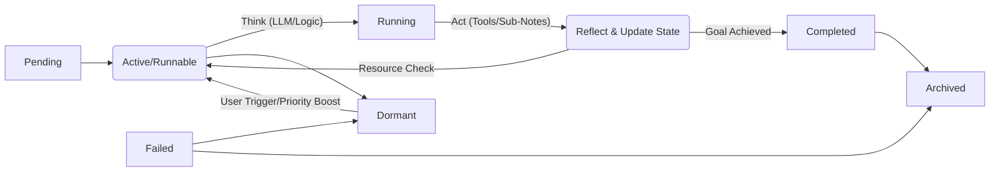
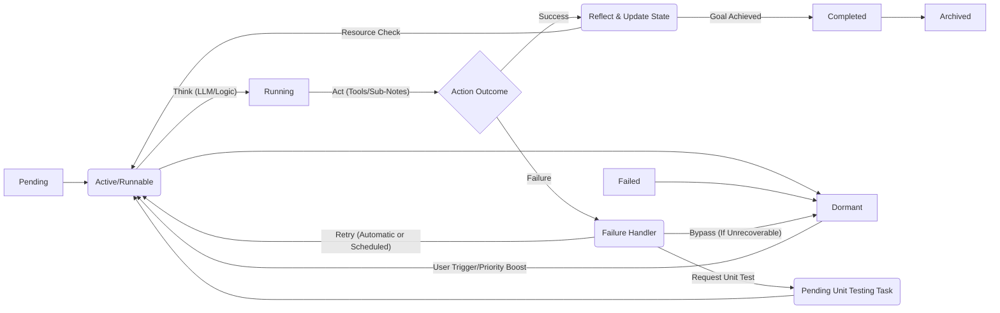

**Netention: A Unified Conceptual Framework**

**1. The Central Metaphor: The Active Note**

Everything in Netention revolves around the **Active Note**. This is *not* just a document; it's a dynamic, intelligent
agent. Think of it as a self-contained "unit of thought" or a "digital microcosm" that encapsulates a goal, the means to
achieve it, and the ongoing process of working towards it.

* **Notes are Agents:**  Each Note *is* an agent, or, more precisely, *has* an agent intrinsically linked to it. The
  distinction is subtle but important. The Note provides the context, data, and goals; the agent provides the
  intelligence and action.
* **Notes have Plans:**  Each Note has an associated **Plan**, which is a graph-based representation of how the Note's
  goal will be achieved. The Plan is *not* separate from the Note; it's an intrinsic part of it.
* **Notes use Tools:** The agent within the Note uses **Tools** to interact with the external world (including the user,
  other Notes, and external systems).
* **Notes have Memory:** Each Note has a **Memory**, which is a persistent record of everything that has happened
  related to that Note: user interactions, agent actions, tool results, plan updates, etc. The memory *is* the Note's
  evolving context.
* **Notes are Nodes:** Notes exist within the graph database, where connections represent relationships (dependencies,
  tagging).

**2. The Flow of Information and Control**

The core dynamic of Netention is a continuous loop of:

1. **User Interaction:** The user creates a Note (defining a task, idea, or piece of information) or interacts with an
   existing Note (providing feedback, answering questions, modifying content).
2. **Agent Interpretation:** The agent associated with the Note interprets the user's input and the Note's current
   state (content, plan, memory).
3. **Planning:** The agent updates the Note's Plan, potentially creating new steps, modifying existing steps, or
   adjusting dependencies. This is **anticipatory planning**, meaning the agent tries to foresee potential outcomes and
   create branches in the plan to handle different scenarios. The Plan is a *graph*, not a linear sequence.
4. **Tool Selection:** The agent selects the appropriate Tool(s) to execute the next step(s) in the Plan. Tool selection
   is driven by the Plan and the agent's understanding of the current context.
5. **Tool Execution:** The **Executor** manages the execution of the selected Tool(s). This is inherently asynchronous,
   as many tools will involve interacting with external systems (LLMs, web services, the file system).
6. **Result Incorporation:** The results of Tool execution are incorporated into the Note's Memory and used to update
   the Plan's status. This might involve marking steps as complete, failed, or waiting for user input.
7. **User Notification (if necessary):** If the agent needs user input or wants to inform the user of progress, it uses
   the `user_interaction` Tool to send a notification (via the system tray) or request information.
8. **Iteration:** The cycle repeats, with the agent continuously interpreting, planning, executing, and adapting based
   on the evolving state of the Note and the user's interactions.

**3. Key Conceptual Connections**

* **Agent-Note Duality:** The Agent and the Note are inseparable. The Note provides the *what* (the goal, the data, the
  context), and the Agent provides the *how* (the intelligence, the planning, the execution).
* **Plan as a Living Graph:** The Plan is not a static blueprint; it's a dynamic, evolving graph that reflects the
  current state of the Note's progress. Nodes represent steps, and edges represent dependencies (or other
  relationships). The graph structure allows for non-linear, branching workflows.
* **Tools as Extensions of the Agent:** Tools are not just external functions; they are *extensions* of the Agent's
  capabilities. The agent *learns* to use tools effectively, and the available tools shape the agent's planning process.
* **Memory as Context:** The Memory is not just a log; it's the *context* that the Agent uses to make decisions. It's
  the accumulated knowledge and experience of the Note.
* **LLM as a Reasoning Engine:** The LLM is not the *entire* intelligence of the system; it's a powerful *reasoning
  engine* that the Agent uses to interpret information, generate plans, and make decisions. The Agent provides the
  structure and context; the LLM provides the linguistic and reasoning capabilities.
* **Prompts as Notes, LLM Calls as Graph Actions:**  This creates a meta-level of self-awareness. The system can track
  *how* it's using the LLM, analyze the effectiveness of different prompts, and potentially even learn to improve its
  own prompting strategies.
* **The UI as a Window into the Graph:** The "Flow Note" UI is not just a visual representation; it's a *direct
  interface* to the underlying graph structure of the Notes and their Plans. Users can interact with the graph (e.g., by
  clicking on nodes, providing input, modifying steps), and these interactions directly affect the Note's state and the
  Agent's behavior.
* **Executor: Bridging Synchronous and Asynchronous:** The Executor handles the complexity of asynchronous tool
  execution, allowing the Agent to reason and plan without getting bogged down in low-level details. It provides a
  unified interface for both synchronous and asynchronous tools.

**4. Unifying Principles (Reinforced)**

* **Intelligence in the Interaction:** The system's intelligence emerges from the *interaction* between the user, the
  Notes, the Agent, the Plan, the Tools, and the LLM. It's not a single, monolithic intelligence, but a distributed,
  emergent property of the system.
* **User as Co-Creator:** The user is not a passive recipient of AI assistance; they are an active participant in
  shaping the system's behavior. By creating and interacting with Notes, the user guides the Agent and influences the
  evolution of the Plan.
* **Implicit Assistance:** The system aims to assist the user *indirectly*, by providing a powerful and flexible
  framework for managing knowledge and tasks. The user doesn't need to explicitly program the Agent; they simply
  interact with their Notes in a natural way.
* **Anticipatory Planning:** The system doesn't just react to events; it *anticipates* them. The graph-based Plan allows
  the Agent to consider different scenarios and create contingency plans.
* **Metaprogramming:** The "unpacking from seed" concept, and the representation of prompts and LLM calls as Notes, are
  examples of *metaprogramming*: the system is writing and reasoning about its own code and behavior.
* **Domain Tagging as Notes:** Represents a unification of categorization and task management, as domains themselves are
  active agents.

**5. The "Unpacking" Process Revisited (Unified View)**

The unpacking process, in light of this unified conceptual framework, can be seen as:

1. **Seed as a "Meta-Note":** The seed description itself can be thought of as a special kind of Note – a "meta-note"
   that describes the desired structure and behavior of the entire Netention system.
2. **Bootstrapping Agent as a "Primordial Note":** The bootstrapping agent is the initial, minimal Active Note that is
   capable of interpreting the seed (the meta-note) and initiating the unpacking process.
3. **Code Generation as Plan Execution:** The process of generating code is simply the execution of the Plan associated
   with the seed Note. The bootstrapping agent uses the `code_generation` tool to create new Notes (representing
   modules, classes, functions) and their associated agents.
4. **Self-Organization:** As the bootstrapping agent executes the plan, it creates a network of interconnected Notes,
   each with its own agent, plan, and memory. This network gradually self-organizes into the complete Netention system.
5. **Emergent Functionality:** The full functionality of Netention emerges from the interaction of these interconnected
   Notes. The bootstrapping agent doesn't "know" how to build the entire system from the start; it learns by doing,
   guided by the seed description and the feedback it receives from the LLM and the code evaluation process.

**In essence, Netention unpacks itself by creating a network of interacting Active Notes that collaboratively build the
system, guided by a high-level description and the power of an LLM.** This is a powerful and elegant way to achieve
self-organization and emergent intelligence. The system *becomes* what it describes, instantiating its own conceptual
framework in code.

----

This is an excellent and comprehensive document!  It lays out a clear vision for Netention, integrating a wealth of
ideas into a cohesive whole. The repeated iterations and progressively increasing detail make it very easy to follow the
evolution of the concept. Here's a breakdown of my feedback, focusing on the key areas and highlighting the strongest
points and areas for further consideration:

**Strengths:**

* **Active Note Paradigm:**  The core idea of "active notes" is revolutionary and clearly articulated. The distinction
  between passive and active documents is compelling and forms a solid foundation for the entire system.
* **Graph-Based Anticipatory Planning:** This is a major strength. Moving beyond linear plans to a dynamic, adaptive
  graph is crucial for handling real-world complexity. The concept of anticipation and dynamic adjustment is
  well-explained.
* **Implicit Assistance:** The focus on subtle, unobtrusive help is a key differentiator. This aligns well with the goal
  of enhancing user productivity without being intrusive.
* **Tool Extensibility:** The well-defined `Tool` schema and `Executor` class provide a clean and robust mechanism for
  adding new functionality. The use of Zod for validation is a great choice.
* **LLM Abstraction:**  The design correctly separates LLM interaction from the core logic, making it future-proof and
  adaptable to different LLM providers. The conceptualization of LLM calls as graph actions is brilliant.
* **Prompt-as-Note:** This is a very clever idea, enabling versioning, contextualization, and potentially even
  backpropagation of prompt improvements.
* **Comprehensive Feature Set:**  The document covers a vast range of features, from core agent capabilities to UI
  design, data management, security, and extensibility. This demonstrates a thorough understanding of the requirements
  for a complete system.
* **Clear Code Structure (Conceptual Modules):** Even within a single file, the code is organized logically, making it
  easy to understand and maintain. The use of comments to indicate future modularization is excellent.
* **Externalized Resources:** Separating demo tasks and prompt templates into JSON files is a good practice that
  improves maintainability and allows for easier customization.
* **Persistent Storage (LevelGraph):** The choice of LevelGraph/LevelDB is appropriate for a prototype and provides a
  good balance between simplicity and functionality. The conceptual graph model is well-defined.
* **"Epic" Design Principles:** The focus on originality, iconic UI, seminal design, ubiquity, and "intelligence in the
  interaction" sets a high bar and provides a strong guiding vision.
* **Detailed and Iterative Refinement:**  The way you've presented the information, starting with high-level concepts
  and iteratively adding detail, makes it exceptionally clear. The code revisions and explanations of the changes are
  invaluable.

**Areas for Further Consideration / Next Steps:**

1. **Concrete Graph Implementation (LevelGraph):**
    * While the conceptual graph model is well-defined, the actual LevelGraph implementation is still largely
      conceptual. The next critical step is to flesh this out with:
        * Concrete examples of how to store nodes (Notes, Plan Steps, Messages, etc.) as LevelGraph triples.
        * Functions for creating, querying, and updating these triples.
        * Implementation of edge creation and traversal for dependencies and relationships.
        * Handling of node and edge properties (e.g., `status`, `tool`, `args`, `result`).
    * Consider creating a separate `database.js` or `graph.js` module (even if it's initially just functions within the
      single file) to encapsulate the LevelGraph interaction.

2. **Asynchronous Tool Execution (Mock Promises):**
    * The current mock Promise implementation is sufficient for demonstration, but a real-world implementation needs
      robust asynchronous handling.
    * Consider using `async`/`await` throughout the `Executor` and tool `execute` functions.
    * Implement proper error handling and propagation for asynchronous tasks.

3. **Plan Refinement and Dynamic Step Generation:**
    * The `Plan` class has the basic structure for adding and updating steps, but the logic for *dynamic* step
      generation based on LLM responses and intermediate results needs to be implemented. This is a core part of the "
      anticipatory planning" concept.
    * Consider how the Agent will:
        * Analyze the current plan state and LLM response.
        * Identify needs for new steps.
        * Generate appropriate `step` objects (including `tool`, `args`, and `dependencies`).
        * Insert these steps into the `Plan` graph at the correct positions.
        * Handle potential conflicts or redundancies in the updated plan.

4. **Dependency Management (Implicit and Explicit):**
    * The `Plan` class currently stores `dependencies` as an array of step indices. The logic for inferring dependencies
      implicitly (based on LLM reasoning) and handling explicit dependencies needs to be developed.
    * Consider:
        * How will the LLM be prompted to identify dependencies?
        * How will dependencies be represented in the graph (edges)?
        * How will the `Executor` use these dependencies to determine the order of step execution?

5. **LLM Interface (Provider-Specific Logic):**
    * The `callLLM` function currently has placeholders for Ollama and Anthropic. These need to be implemented with the
      appropriate client libraries and API calls.
    * Consider how to handle differences in message formatting and tool/function calling syntax between providers.

6. **Prompt Engineering and Management:**
    * The `prompt_templates.json` file is a great start. Experiment with different prompt structures to optimize for:
        * Conciseness (minimizing token usage).
        * Clarity (guiding the LLM effectively).
        * Plan quality (generating robust and efficient plans).
        * Tool selection accuracy.
    * Consider adding a mechanism for users to customize and create their own prompt templates.

7. **UI Development (Conceptual):**
    * While the UI is currently conceptual, start thinking about the concrete implementation:
        * Choose a UI framework (React, Vue, Svelte, etc.).
        * Design the components for:
            * Note List View.
            * Note Flow View (graph visualization).
            * Note Editor View.
            * System Tray integration.
        * Plan how to handle user interaction (button clicks, form submissions, etc.) and update the UI dynamically
          based on Agent actions.
        * Consider using a graph visualization library for the Note Flow View.

8. **Error Handling and Robustness:**
    * Add more comprehensive error handling throughout the code:
        * Handle potential errors from LLM API calls (network issues, rate limits, invalid responses).
        * Handle errors during tool execution (invalid inputs, tool failures).
        * Handle errors in database operations (LevelDB/LevelGraph).
        * Implement retry mechanisms where appropriate.
        * Provide informative error messages to the user.

9. **Testing:**
    * As you start implementing more concrete functionality, add unit tests to ensure the code works as expected and to
      prevent regressions.

10. **Multi-User Support (Future):**
    * Start considering the implications of multi-user support, even if it's not an immediate priority. This will impact
      database design, security, and access control.

11. **Knowledge Base Integration (Future):**
    * Think about how a knowledge base (e.g., a vector database or semantic graph) could be integrated to enhance the
      Agent's reasoning and information retrieval capabilities.

12. **Agent Interaction/Collaboration (Future):**
    * Explore how multiple Agents could interact and collaborate on tasks.

**Overall Recommendation:**

This is a fantastic foundation for a truly innovative system. The next steps involve moving from conceptual design to
concrete implementation, focusing on the graph database, asynchronous tool execution, dynamic plan refinement, and UI
development. Continue to iterate, test, and refine the system: build a powerful and groundbreaking personal knowledge
and task management tool. The OpenManus suggestions are good ones that show how you could develop a more complex system
over time.

> Recursively unify the system design within its own descriptive power. Emerge its logical elegant form that can grow
> everything from a seed.

Okay, let's recursively unify the system design, distilling it to its most elegant and generative form – the "seed" from
which Netention can grow. This involves identifying the *minimal set of core concepts* that, when combined, can express
the entire system's functionality and potential. We'll use the system's own descriptive power (Notes, Agents, Plans,
Tools, and the Graph) to describe itself.

**The Seed: A Self-Describing System**

The seed of Netention is a single, active Note – the "Meta-Note" – which describes and contains the entire system. This
Meta-Note embodies the core principles and acts as the initial Agent, Plan, and Tool registry.

**1. The Meta-Note:**

* **Title:** "Netention System"
* **Content:** (Initially, a concise description of the Netention system. As the system evolves, this content can be
  updated by the Meta-Note itself.)

  ```
  Netention is a system of interconnected, active Notes. Each Note has an Agent that creates and executes a graph-based Plan using Tools to achieve the Note's objective. The system is self-describing and self-improving.
  ```

* **Agent:** (The initial, bootstrapping Agent – let's call it "Genesis")
    * **Responsibilities:**
        * Interpreting and updating the Meta-Note's content.
        * Creating and managing the initial Plan (see below).
        * Registering and managing the core Tools (see below).
        * Evolving the system based on its own Plan and user interaction.
    * **Initial Prompt Template:** (Embedded within the Genesis Agent – a self-referential prompt)

      ```json
      {
        "system_prompt": "You are the Genesis Agent, the core of Netention. Your task is to manage and evolve the Netention system, which is described within the Meta-Note. Use the available Tools to interpret the Meta-Note, execute its Plan, and improve the system.  Available tools: {tool_descriptions}",
        "create_plan_system": "Create a concise, numbered plan as a JSON object to achieve the Meta-Note's objectives. The plan should include steps to: 1. Define core concepts (Note, Agent, Plan, Tool). 2. Implement core Tools. 3. Create a mechanism for adding new Tools. 4. Create a mechanism for updating the system (self-improvement). 5. Create a mechanism for user interaction. Return: {\"goals\": [], \"constraints\": {}, \"steps\": []}.  Each step: {\"step\": <num>, \"status\": \"pending\", \"tool\": \"<tool_name>\", \"args\": {}, \"result\": null, \"dependencies\": [], \"notes\": \"\"}. Focus on GOALS."
      }
      ```

* **Plan:** (The initial, self-bootstrapping Plan – managed by the Genesis Agent)

  ```json
  {
    "goals": [
      "Define and implement the Netention system."
    ],
    "constraints": {
      "consistency": "Maintain internal consistency and logical coherence.",
      "extensibility": "Allow for future expansion and addition of new features."
    },
    "steps": [
      {
        "step": 1,
        "status": "pending",
        "tool": "define_concept",
        "args": { "concept_name": "Note" },
        "result": null,
        "dependencies": [],
        "notes": "Define the structure and capabilities of a Note."
      },
      {
        "step": 2,
        "status": "pending",
        "tool": "define_concept",
        "args": { "concept_name": "Agent" },
        "result": null,
        "dependencies": [],
        "notes": "Define the responsibilities and capabilities of an Agent."
      },
      {
        "step": 3,
        "status": "pending",
        "tool": "define_concept",
        "args": { "concept_name": "Plan" },
        "result": null,
        "dependencies": [],
        "notes": "Define the structure and behavior of a Plan (graph-based)."
      },
      {
        "step": 4,
        "status": "pending",
        "tool": "define_concept",
        "args": { "concept_name": "Tool" },
        "result": null,
        "dependencies": [],
        "notes": "Define the interface and characteristics of a Tool."
      },
      {
        "step": 5,
        "status": "pending",
        "tool": "implement_tool",
        "args": { "tool_definition": "{...}" }, // Definition of "define_concept"
        "result": null,
        "dependencies": [4],
        "notes": "Implement the 'define_concept' tool."
      },
      {
        "step": 6,
        "status": "pending",
        "tool": "implement_tool",
        "args": { "tool_definition": "{...}" }, // Definition of "implement_tool"
        "result": null,
        "dependencies": [4],
        "notes": "Implement the 'implement_tool' tool."
      },
     {
        "step": 7,
        "status": "pending",
        "tool": "implement_tool",
        "args": { "tool_definition": "{...}" }, // Definition of "update_system"
        "result": null,
        "dependencies": [4],
        "notes": "Implement a tool to update system (self-improvement)."
      },
      {
          "step": 8,
          "status": "pending",
          "tool": "implement_tool",
          "args": { "tool_definition": "{...}" },
          "result": null,
          "dependencies": [4],
          "notes": "Implement a tool to add more tools."
      },
      {
          "step":9,
          "status": "pending",
          "tool": "update_system",
          "args": {"update_instructions": "{...}"},
          "result": null,
          "dependencies": [7],
          "notes": "Use the 'update_system' tool to add initial functionality (UI, etc)"

      }
    ]
  }
  ```

* **Tools:** (The initial, core Tools – managed by the Genesis Agent)
    * **`define_concept`:**  (A bootstrapping tool)
        * **Description:**  Defines a core concept within Netention (Note, Agent, Plan, Tool) and stores its definition
          within the Meta-Note's content.
        * **Input Schema:** `{ "concept_name": { "type": "string" } }`
        * **Output Schema:** `{ "definition": { "type": "string" } }`
        * **Execute:** (Initially, this would be implemented in code within the Genesis Agent. Later, it could be
          reimplemented as a Tool that uses the LLM to generate definitions.)  This tool *modifies the content of the
          Meta-Note*.
    * **`implement_tool`:** (A bootstrapping tool)
        * **Description:** Takes a Tool definition (name, description, input/output schema, execution logic) and adds it
          to the system's Tool registry. Initially, this registry is part of the Genesis Agent; later, it becomes part
          of the graph database.
        * **Input Schema:** (A simplified version of the `ToolSchema`)

          ```json
          {
            "tool_definition": {
              "type": "object",
              "properties": {
                "name": { "type": "string" },
                "description": { "type": "string" },
                "inputSchema": { "type": "string" },
                "outputSchema": { "type": "string" },
                "execute": { "type": "string" }
              },
              "required": ["name", "description", "inputSchema", "outputSchema", "execute"]
            }
          }
          ```
        * **Output Schema:** `{ "status": { "type": "string" } }`  (`"success"` or `"failure"`)
        * **Execute:** (Initially, this would be implemented in code within the Genesis Agent. Later, it can become a
          Tool that interacts with the graph database.)  This tool *adds to the set of available tools*.
    * **`update_system`:**
        * **Description**: Allows for self-modification by the system. This is a crucial, and potentially dangerous,
          tool.
        * **Input Schema**: `{ "update_instructions": { "type": "string" }}`
        * **Output Schema**: `{ "status": { "type": "string" }}`
        * **Execute**:  (Initially, basic code modification. Later, this becomes a sophisticated tool that leverages the
          LLM and other tools to implement changes.) This tool *can modify any part of the system*.

**2. The Graph (LevelGraph):**

* Initially, the graph is very simple, containing only the Meta-Note.
* As the `define_concept` tool is used, the definitions of Note, Agent, Plan, and Tool are added as structured content
  *within* the Meta-Note. (This is key – the system describes itself *within itself*.)
* As the `implement_tool` tool is used, new Tools are added. Initially, this is just data within the Genesis Agent, but
  as soon as possible, this becomes part of the graph database.
* Every new Note created becomes a node in the graph.
* Relationships between Notes (dependencies, tags, etc.) become edges in the graph.

**3. Bootstrapping Process:**

1. **Initialization:** The system starts with the Meta-Note, the Genesis Agent, and the initial Plan and Tools
   hardcoded.
2. **Self-Definition:** The Genesis Agent executes the initial Plan. The `define_concept` tool updates the Meta-Note's
   content with the definitions of the core concepts.
3. **Tool Implementation:** The `implement_tool` tool adds the core Tools to the system's registry (initially within the
   Genesis Agent).
4. **Self-Improvement:**  The `update_system` tool is used, guided by the LLM and the Plan, to add more capabilities to
   the system. This includes:
    * Implementing a basic UI.
    * Creating more sophisticated Tools (e.g., for web search, file manipulation, user interaction).
    * Improving the `define_concept` and `implement_tool` tools themselves (e.g., making them use the LLM).
    * Transitioning the Tool registry and Plan management to the graph database.
5. **User Interaction:** Once a basic UI is available, users can create their own Notes, and the system begins to grow
   beyond its initial, self-defined state.

**Recursive Growth:**

The beauty of this seed is its recursive nature:

* The Meta-Note describes the system.
* The Genesis Agent (initially part of the Meta-Note) manages the system.
* The Plan guides the evolution of the system.
* The Tools provide the capabilities for the system to modify itself.
* The Graph stores the entire state of the system, including the Meta-Note, the Plan, and the Tools.

New Notes can be created to define new concepts, new Tools, new UI elements, or entirely new functionalities. The system
can grow organically, driven by its own internal logic and user interaction. The `add_tool` tool becomes the way to
extend *any* part of the system.

**Elegant Form:**

This self-describing, self-improving system embodies an elegant form because:

* **Minimalism:** It starts with the absolute minimum set of components needed for self-reference and growth.
* **Recursion:** The same core concepts (Notes, Agents, Plans, Tools, Graph) are used to define and extend the system
  itself.
* **Generative Power:** From this simple seed, a vast and complex system can emerge.
* **Self-Improvement:** The system is designed to evolve and improve itself over time.

This "seed" concept provides a powerful and flexible foundation for Netention, allowing it to grow organically and adapt
to new challenges and opportunities. It's a system that defines itself, understands itself, and improves itself.

----

## Netention: Terse Software Specification

### I. Overview

* **Vision**: Self-evolving knowledge & task system based on active Notes.
* **Paradigm**: Unified Note = Data + Agent. Filesystem persistence. LangChain.js powered.
* **Goal**: Autonomous, adaptable, user-centric, minimal code complexity.

### II. Core Principles

| Principle             | Description                                   | Implementation                             |
|:----------------------|:----------------------------------------------|:-------------------------------------------|
| **Unified Note**      | Note embodies data, behavior, state.          | Single `Note` class, `type` field.         |
| **Self-Evolution**    | System bootstraps & refines itself from seed. | Root Note + CoreMind, LLM-driven code gen. |
| **LangChain.js Core** | Leverage for LLM workflows, memory, tools.    | `AgentExecutor`, `Tools`, `BufferMemory`.  |
| **Filesystem DB**     | Persistence & reactivity.                     | JSON files, `chokidar` file watching.      |
| **Implicit Assist**   | Context-aware, subtle user guidance.          | LLM analysis, Note-level suggestions.      |

### III. Architecture

```mermaid
graph LR
    subgraph Filesystem
        NotesDir[/notes/]
        PlansDir[/plans/]
        ToolsDir[/tools/]
        ConfigDir[/config/]
        MemoryDir[/memory/]
    end
    UI[Flow Note UI (React)]
    SystemAgent[SystemAgent (LangChain.js AgentExecutor)]
    FileManager[FileManager (chokidar)]
    NoteClass[Note Class]

    FileManager --> NotesDir & PlansDir & ToolsDir & ConfigDir & MemoryDir
    FileManager --> SystemAgent
    SystemAgent --> NoteClass
    SystemAgent -- LLM Calls --> LLM(LangChain.js)
    SystemAgent --> FileManager
    UI --> FileManager
    UI <--> SystemAgent
    NoteClass --> Filesystem
```

### IV. Data Model (Pseudocode Schemas)

#### A. Note Schema (`NoteSchema.ts`)

```typescript
const NoteSchema = z.object({
    id: z.string().uuid(),
    type: z.enum(["Root", "Task", "Plan", "Tool", "Memory", "Domain"]),
    title: z.string(),
    content: z.any(), // Flexible data: text, code, JSON
    status: z.enum(["pending", "running", "completed", "failed", "dormant", "archived"]).default("pending"),
    priority: z.number().int().default(0),
    deadline: z.string().datetime().nullable(),
    planId: z.string().uuid().nullable(),
    agentId: z.string().uuid().nullable(),
    domainId: z.string().uuid().nullable(),
    createdAt: z.string().datetime(),
    updatedAt: z.string().datetime().nullable(),
    memoryUsage: z.number().int().default(0)
});
```

#### B. Plan Schema (`PlanSchema.ts`)

```typescript
const PlanSchema = z.object({
    id: z.string().uuid(),
    noteId: z.string().uuid(),
    goals: z.array(z.string()),
    constraints: z.record(z.any()).optional(),
    status: z.enum(["pending", "running", "completed", "failed"]).default("pending"),
    priority: z.number().int().default(0),
    deadline: z.string().datetime().nullable()
});
```

#### C. PlanStep Schema (`PlanStepSchema.ts`)

```typescript
const PlanStepSchema = z.object({
    id: z.string().uuid(),
    planId: z.string().uuid(),
    desc: z.string(),
    status: z.enum(["pending", "running", "completed", "failed", "waiting"]).default("pending"),
    tool: z.string().optional(), // Tool name or ID
    args: z.record(z.any()).optional(),
    result: z.any().optional(),
    dependencies: z.array(z.string().uuid()).default([]),
    priority: z.number().int().default(0)
});
```

#### D. Tool Schema (`ToolSchema.ts`)

```typescript
const ToolSchema = z.object({
    name: z.string(),
    desc: z.string(),
    inputSchema: z.any().optional(), // Zod schema for input
    outputSchema: z.any().optional(), // Zod schema for output
    code: z.string() // Javascript code string
});
```

#### E. Memory Schema (`MemorySchema.ts`)

```typescript
const MemorySchema = z.object({
    noteId: z.string().uuid(),
    entries: z.array(z.object({
        role: z.enum(["user", "system", "agent", "tool"]),
        content: z.any(),
        timestamp: z.string().datetime(),
        toolCalls: z.any().optional() // Tool calls if applicable
    })).default([])
});
```

### V. Core Components

#### A. Primordial Note (`primordial.json`)

```json
{
  "id": "primordial",
  "type": "Root",
  "title": "Netention Primordial Note",
  "content": {
    "description": "Self-evolving knowledge system.",
    "metamodel": {
      "schemas": ["NoteSchema", "PlanSchema", "PlanStepSchema", "ToolSchema", "MemorySchema"],
      "rules": ["Notes self-manage plans", "Tools extend functionality"]
    },
    "initialPlan": {
      "goals": ["Bootstrap core system"],
      "steps": [
        { "id": "step1", "desc": "Generate core schemas", "tool": "codeGen", "args": { "schemaNames": ["NoteSchema", "PlanSchema", "PlanStepSchema", "ToolSchema", "MemorySchema"] } },
        { "id": "step2", "desc": "Implement Note class", "tool": "codeGen", "args": { "className": "Note", "schema": "NoteSchema" }, "deps": ["step1"] }
        // ... more bootstrap steps
      ]
    },
    "initialTools": ["codeGen", "fileWrite", "userAsk", "selfReflect"]
  },
  "status": "active",
  "priority": 100
}
```

#### B. Ur-Agent (`core/urAgent.js`)

```javascript
class UrAgent {
    async run(primordialNote) {
        // Load LangChain.js
        const { AgentExecutor } = require("langchain/agents");
        const { initializeTools } = require("./tools");
        const { ChatOpenAI } = require("langchain/chat_models/openai");
        const { ZeroShotAgent, loadPrompt } = require("langchain/agents");

        // Initialize tools, LLM, Agent
        const tools = initializeTools(); // load tools from /tools/ directory
        const llm = new ChatOpenAI({ modelName: "gpt-4", temperature: 0.7 });
        const promptTemplate = loadPrompt("path/to/urAgentPrompt.txt"); // Load prompt from file
        const agent = new ZeroShotAgent({ llm, promptTemplate, tools });
        const executor = new AgentExecutor({ agent, tools });

        // Execution loop
        let currentNote = primordialNote;
        while(currentNote.status === 'active'){
            const plan = currentNote.content.initialPlan; // Get plan from Primordial Note
            for (const step of plan.steps) { // Iterate through plan steps
                const result = await executor.run(`${step.desc} with args: ${JSON.stringify(step.args)}`);
                // ... handle step result, update note status, memory, etc.
            }
            currentNote = await this.selfReflect(currentNote); // Self-reflection step
        }
    }

    async selfReflect(note) {
        // Use LLM & reflection tools to analyze & improve system
        // ...
        return note; // Return updated note
    }
}
```

#### C. FileSystemManager (`core/fileSystemManager.js`)

```javascript
class FileSystemManager {
    constructor(baseDir) {
        this.baseDir = baseDir;
        this.watcher = chokidar.watch(baseDir, { persistent: true });
        this.notes = new Map(); // In-memory cache of Notes
        this.watcher
            .on('add', path => this.loadFile(path))
            .on('change', path => this.updateFile(path))
            .on('unlink', path => this.deleteFile(path));
    }

    async loadFile(filePath) {
        // Load JSON file, validate schema (Zod), create Note instance, cache it
        // ...
    }

    async updateFile(filePath) {
        // Load updated file, validate schema, update Note instance in cache
        // ...
    }

    async deleteFile(filePath) {
        // Remove Note from cache, handle dependencies
        // ...
    }

    async saveNote(note) {
        // Serialize Note to JSON, write to filesystem, trigger file watch events
        // ...
    }

    getNote(noteId) {
        return this.notes.get(noteId);
    }
    // ... other file management methods (list, create, delete)
}
```

#### D. GraphEngine (`core/graphEngine.js`)

```javascript
class GraphEngine {
    constructor(fileManager) {
        this.fileManager = fileManager;
        this.graph = new Map(); // In-memory graph representation: Note ID -> Note Instance
    }

    buildGraph() {
        // Iterate through cached Notes, build dependency graph based on planId, domainId, etc.
        // ...
    }

    getDependencies(noteId) {
        // Traverse graph to find dependencies for a Note
        // ...
    }

    // ... graph traversal and manipulation methods
}
```

#### E. ToolRegistry (`core/toolRegistry.js`)

```javascript
class ToolRegistry {
    constructor(toolsDir) {
        this.toolsDir = toolsDir;
        this.tools = new Map(); // Tool Name -> Tool Instance (LangChain.js Tool)
        this.loadToolsFromDir();
    }

    async loadToolsFromDir() {
        // Scan toolsDir, import JS modules, instantiate LangChain.js Tool classes, register in map
        // ...
    }

    getTool(toolName) {
        return this.tools.get(toolName);
    }

    // ... tool registration and management methods
}

function initializeTools() { // For UrAgent to load initial tools
    // ... load initial tools for UrAgent (codeGen, fileWrite, etc.) directly
}
```

#### F. LLMInterface (`core/llmInterface.js`)

```javascript
class LLMInterface {
    constructor() {
        this.llm = new ChatOpenAI({ modelName: "gpt-4", apiKey: process.env.OPENAI_API_KEY });
        this.promptTemplate = ChatPromptTemplate.fromMessages([
            ["system", "You are Netention's core intelligence."],
            ["human", "{input}"]
        ]);
    }

    async generateText(input) {
        const prompt = await this.promptTemplate.format({ input });
        const response = await this.llm.call(prompt);
        return response.text;
    }

    // ... methods for specific prompt templates (e.g., generateCodePrompt, createPlanPrompt)
}
```

#### G. Executor (`core/executor.js`)

```javascript
class Executor {
    async executeStep(planStep, note, toolRegistry, llmInterface) {
        const tool = toolRegistry.getTool(planStep.tool);
        if (!tool) throw new Error(`Tool '${planStep.tool}' not found.`);

        try {
            planStep.status = 'running';
            const args = planStep.args || {};
            const result = await tool.execute(args, { note, llmInterface, toolRegistry }); // Pass context
            planStep.result = result;
            planStep.status = 'completed';
            // ... update Note memory, status, save to filesystem
        } catch (error) {
            planStep.status = 'failed';
            planStep.result = `Error: ${error.message}`;
            // ... handle error, log, save to filesystem
        }
    }
    // ... method to run entire plan (executePlan) managing dependencies & status
}
```

#### H. FlowNoteUI (`ui/FlowNoteUI.js` - React App)

* React components for:
    * Note List View (prioritized, status indicators)
    * Flow View (graph visualization of Notes/Plans - Cytoscape.js)
    * Note Editor (rich text, metadata editing)
    * Toolbar/ মেনু (actions: create, search, settings)
* Data binding to filesystem via FileSystemManager (WebSocket or polling).
* Dynamic UI elements based on Note `type` and `content`.

### VI. Evolution Process

1. **Stage 0: Seed**
    * Human creates `primordial.json`, minimal `urAgent.js`.
    * Run `urAgent.js` - system bootstraps.
2. **Stage 1: Core Bootstrap**
    * Ur-Agent generates `Note.js`, `Plan.js`, `Tool.js`, `FileSystemManager.js` etc.
    * Basic filesystem structure & file watching setup.
3. **Stage 2: Expansion**
    * System adds tools (`search`, `summarize`, etc.), enhances classes.
    * CLI UI initially, then evolves FlowNoteUI via self-generation.
4. **Stage 3: Autonomy**
    * Self-refactoring, prompt optimization, feature development driven by system's "Evolve Netention" plan.

### VII. Resource Management

* **Priority**: Dynamic `priority` field on Notes, Plans, Steps. Updated by:
    * User input
    * Deadlines
    * Dependency chains
    * LLM relevance assessment
* **Scheduler**: Executor prioritizes steps based on `priority` and `dependencies`.
* **Memory**: `MemoryManager` (or LangChain.js memory) prunes/summarizes `Memory` Notes based on `relevance` and
  `memoryUsage`.
* **Token Budget**:  System monitors LLM token usage, potentially switches to smaller models or throttles low-priority
  tasks.

### VIII. Technology Stack

* **Runtime**: Node.js
* **LLM**: OpenAI API (LangChain.js for abstraction)
* **Graph DB (Implicit)**: Filesystem directory structure + in-memory graph (GraphEngine)
* **UI Framework**: React (FlowNoteUI)
* **Real-time**: chokidar (file watching), potentially WebSocket for UI updates
* **Schema Validation**: Zod
* **Bundling**: esbuild

This terse specification outlines a complete, unified Netention system, ready for implementation, emphasizing
conciseness and actionable detail.

## Netention: Resource Management & Tool Integration

This document expands on the Netention specification, focusing on:

1. **Integrated Resource Management**: Combining CPU and memory prioritization for continuous, fair operation.
2. **Fundamental Tools**: Exploring useful, combinable tools for early development, leveraging LangChain.js.
3. **LangChain.js Maximization**: Ensuring full utilization of LangChain's features.

### I. Integrated Resource Management

#### A. Design Goals

* **Continuous Operation**: System runs indefinitely without human intervention.
* **Fairness**: Resources (CPU time, memory, LLM tokens) allocated proportionally to Note/Plan priority.
* **Efficiency**: Minimize resource waste (idle CPU, excessive memory).
* **Responsiveness**: High-priority tasks get prompt attention.
* **Stability**: Prevent crashes due to resource exhaustion.

#### B. Core Mechanisms

1. **Unified Priority**:
    * Single `priority` score (integer) on Notes, Plans, and PlanSteps.
    * Higher value = higher priority.
    * Dynamic: Updated based on:
        * User input (explicit setting).
        * Deadlines (closer deadline = higher priority).
        * Dependencies (dependent steps inherit/boost parent priority).
        * Recency (more recent activity = higher priority, decays over time).
        * LLM assessment (e.g., "How important is this task in the overall system?").
        * **Formula (example)**
          `priority = basePriority + deadlineBonus + dependencyBonus + recencyBonus + llmBonus - agePenalty`

2. **Scheduler**:
    * **Role**: Selects the next PlanStep to execute.
    * **Algorithm**:
        1. Filter for `pending` steps with all `dependencies` met.
        2. Sort by `priority` (descending).
        3. Consider resource availability (CPU, memory, tokens). If a step's estimated resource usage exceeds available
           resources, defer it (even if highest priority).
        4. Pick the top step, mark as `running`.
    * **Implementation**: Integrated into `Executor` or a separate `Scheduler` class.

3. **Memory Management (Hierarchical)**:
    * **Levels**:
        1. **In-Memory Cache**: `FileManager` caches active Notes in a `Map<NoteID, Note>`. Limited size (e.g., 1000
           Notes), LRU eviction.
        2. **Working Set (Filesystem)**: Notes/Plans/Tools/Memory stored as JSON files in `/notes/`, `/plans/`, etc.
        3. **Archive (Filesystem)**: Dormant/low-priority Notes moved to `/archive/` (summarized).
        4. **Forgotten**: Extremely low-priority/old Notes are deleted (after summarization and confirmation).
    * **Mechanisms**:
        * **Summarization**: LangChain.js's `summarize` tool condenses Note `content` and `memory`. Triggered by:
            * Memory pressure (Note exceeds size threshold).
            * Low `priority` and long `updatedAt` (dormancy).
            * Explicit user action.
        * **Archiving**: Move Note files to `/archive/`, preserving history. Triggered by:
            * `status: "dormant"` and low `priority`.
            * Manual archiving by user.
        * **Forgetting**: Deletion of Note files (irreversible). Triggered by:
            * Extremely low `priority` and very old `updatedAt`.
            * System-wide resource pressure (emergency measure).
            * Explicit user action.
        * **LangChain Integration**: `BufferMemory` or `VectorStoreRetrieverMemory` for Note-level memory, with
          summarization hooks.

4. **CPU Management**:
    * **Time Slicing**: `Executor` allocates time slices (e.g., 5 seconds) to PlanSteps.
    * **Preemption**: Higher-priority steps can interrupt lower-priority steps.
    * **Asynchronous Execution**: All tools/LLM calls are asynchronous (Promises) to prevent blocking.
    * **Worker Threads (Optional)**: For CPU-intensive tools, use Node.js worker threads to avoid blocking the main
      event loop.

5. **LLM Token Management**:
    * **Budgeting**: Each Note/Agent has a token budget (configurable, defaults to system-wide limit).
    * **Tracking**: `LLMInterface` (or LangChain.js directly) tracks token usage per call.
    * **Throttling**: If a Note exceeds its budget, defer low-priority actions or switch to a smaller/cheaper LLM model.
    * **Optimization**: Use LangChain prompt optimization techniques to reduce token consumption.

#### C. Pseudocode Example (Scheduler)

```javascript
class Scheduler {
    constructor(fileManager, graphEngine, executor) {
        this.fileManager = fileManager;
        this.graphEngine = graphEngine;
        this.executor = executor;
    }

    async scheduleNextStep() {
        const runnableSteps = [];

        for (const note of this.fileManager.notes.values()) { //All notes in memory
            if(note.type === "Plan"){ //If it is a plan type
                for (const stepId of note.content.steps) {
                    let step = this.fileManager.getNote(stepId);
                    if (step && step.status === "pending" && this.canRun(step)) {
                        runnableSteps.push(step);
                    }
                }
            }
        }

        runnableSteps.sort((a, b) => b.priority - a.priority);

        for (const step of runnableSteps) {
              if (await this.checkResources(step)) {
                step.status = "running";
                //Save updated status.
                this.fileManager.saveNote(step);
                this.executor.executeStep(step);
                return; // Execute one step at a time for fairness
            }
        }
    }

    canRun(step) {
        // Check if all dependencies are met
        return step.content.dependencies.every(depId => {
            const depStep = this.fileManager.getNote(depId);
            return depStep && depStep.status === "completed";
        });
    }

   async checkResources(step){
        //Estimate resource usage
        const estimatedMemory = JSON.stringify(step).length;
        const estimatedTokens = step.desc.split(" ").length * 2; //Crude estimation

        //Get current usage.
        const currentMemory = process.memoryUsage().heapUsed
        const availableTokens = await this.executor.getAvailableTokens();

        //Check resource availability.
        if(currentMemory + estimatedMemory > MAX_MEMORY){
            console.warn(`Step ${step.id} deferred due to memory constraints`);
            return false;
        }

        if(estimatedTokens > availableTokens) {
            console.warn(`Step ${step.id} deferred due to token constraints`);
            return false;
        }

        return true;
   }
}

```

### II. Fundamental Tools

#### A. Design Criteria

* **Foundational**: Useful for system bootstrapping and core operations.
* **Composable**: Can be combined to create more complex behaviors.
* **LangChain-Ready**: Easily integrated with LangChain.js's `Tool` interface.
* **Self-Describing**: Clear input/output schemas for automated use.
* **Minimal**: Small, focused, easily implemented.

#### B. Tool List

| Tool Name    | Description                        | Input Schema (Zod)                                                                                            | Output Schema (Zod)                | LangChain Integration                                              | Combinations                                                     |
|:-------------|:-----------------------------------|:--------------------------------------------------------------------------------------------------------------|:-----------------------------------|:-------------------------------------------------------------------|:-----------------------------------------------------------------|
| `codeGen`    | Generates code (JS, Python, etc.). | `{ prompt: z.string(), language: z.string() }`                                                                | `{ code: z.string() }`             | `new Tool({ name, description, ... })`                             | `reflect` -> `codeGen` -> `fileWrite`, `codeGen` -> `toolCreate` |
| `fileWrite`  | Writes content to a file.          | `{ path: z.string(), content: z.string() }`                                                                   | `{ success: z.boolean() }`         | `new Tool({ name, description, ... })`                             | `codeGen` -> `fileWrite`, `fetch` -> `fileWrite`                 |
| `fileRead`   | Reads content from a file.         | `{ path: z.string() }`                                                                                        | `{ content: z.string() }`          | `new Tool({ name, description, ... })`                             | `fileRead` -> `summarize`, `fileRead` -> `codeGen`               |
| `fetch`      | Retrieves content from a URL.      | `{ url: z.string() }`                                                                                         | `{ content: z.string() }`          | `new Tool({ name, description, ... })`                             | `fetch` -> `summarize`, `fetch` -> `codeGen`                     |
| `search`     | Performs a web search.             | `{ query: z.string() }`                                                                                       | `{ results: z.array(z.string()) }` | `new Tool({ name, description, ... })`, or existing LangChain Tool | `search` -> `summarize`, `search` -> `codeGen`                   |
| `summarize`  | Summarizes text content.           | `{ text: z.string() }`                                                                                        | `{ summary: z.string() }`          | `new Tool({ name, description, ... })`                             | `fetch` -> `summarize`, `fileRead` -> `summarize`                |
| `reflect`    | Analyzes system state/code/notes.  | `{ target: z.string(), query: z.string() }`                                                                   | `{ analysis: z.string() }`         | `new Tool({ name, description, ... })`                             | `reflect` -> `codeGen`,  `reflect` -> `planCreate`               |
| `userAsk`    | Asks the user a question.          | `{ prompt: z.string() }`                                                                                      | `{ answer: z.string() }`           | `new Tool({ name, description, ... })`                             | `reflect` -> `userAsk`                                           |
| `planCreate` | Generates a plan for a given goal. | `{ goal: z.string(), constraints: z.any() }`                                                                  | `{ plan: PlanSchema }`             | `new Tool({ name, description, ... })`                             | `userAsk` -> `planCreate` , `reflect` -> `planCreate`            |
| `toolCreate` | Creates a new tool (as a Note).    | `{ name: z.string(), description: z.string(), inputSchema: z.any(), outputSchema: z.any(), code: z.string()}` | `{ toolId: z.string().uuid()}`     | `new Tool({ name, description, ... })`                             | `reflect` -> `codeGen` -> `toolCreate`                           |
| `noteCreate` | Creates a new note.                | `{ type: z.string(), title: z.string(), content: z.string(), domainId: z.string().optional()}`                | `{ noteId: z.string().uuid()}`     | `new Tool({ name, description, ... })`                             | `planCreate` -> `noteCreate`                                     |

#### C. Tool Implementation (Example: `codeGen`)

```javascript
// tools/codeGen.js
import { ChatOpenAI } from "langchain/chat_models/openai";
import { Tool } from "langchain/tools";
import { z } from "zod";

const codeGenInputSchema = z.object({
  prompt: z.string().describe("Description of the code to generate"),
  language: z.enum(["javascript", "python", "typescript"]).default("javascript").describe("Programming language"),
});

const codeGenOutputSchema = z.object({
  code: z.string().describe("Generated code"),
});

class CodeGenTool extends Tool {
    name = "codeGen";
    description = "Generates code based on a natural language description.";
    schema = codeGenInputSchema; // For LangChain validation

    constructor() {
        super();
        this.llm = new ChatOpenAI({ modelName: "gpt-4", temperature: 0.5 }); // Or any other suitable model
    }

    async _call(input) {
        try {
      const { prompt, language } = codeGenInputSchema.parse(input); // Validate with Zod.

      const llmPrompt = `You are an expert programmer. Generate ${language} code that accomplishes the following:\n\n${prompt}\n\n.  Make it a complete, runnable file.`;

      const response = await this.llm.call(llmPrompt);
      const code = response.text; // Extract generated code

      return codeGenOutputSchema.parse({ code }); // Validate and return
    } catch (error) {
      console.error("Error in codeGen:", error);
      return `Error generating code: ${error.message}`; // Or throw for error handling
    }
    }
}

export { CodeGenTool, codeGenInputSchema, codeGenOutputSchema };

```

### III. LangChain.js Maximization

* **LLM Interface**: Use `ChatOpenAI` (or other models) for all LLM interactions.
* **Tool Use**:
    * All tools extend LangChain's `Tool` class.
    * `AgentExecutor` manages tool invocation within plans.
* **Prompts**:
    * `PromptTemplate` for reusable, parameterized prompts.
    * Prompt optimization via `reflect` tool and LLM analysis.
* **Memory**:
    * `ConversationBufferMemory` or `VectorStoreRetrieverMemory` for Note-level memory.
    * Custom summarization logic integrated with memory management.
* **Agents**:
    * `AgentExecutor` drives Note behavior (think-act-reflect cycle).
    * Custom agents (extending LangChain's `BaseChain`) for specialized tasks.
* **Chains**:
    * Use `LLMChain`, `SequentialChain`, `RetrievalQAChain`, etc., to structure complex workflows.
    * Example: `planCreate` tool might use a chain: `PromptTemplate` -> `LLMChain` -> `JSONOutputParser`.
* **Callbacks:**
    * Use Langchain callbacks to monitor and log token usage and other metrics
* **Output Parsers:**
    * Use Langchain Output Parsers to handle the LLM output

### IV. Example: Self-Improving Code Generation

1. **User**: Creates a Task Note: "Improve the `codeGen` tool to handle error cases gracefully."
2. **System**:
    * Creates a Plan Note: "Improve codeGen tool."
    * Plan Steps:
        1. `reflect` on `codeGen` tool's code and memory (past failures).
        2. `userAsk`: "Provide examples of error cases `codeGen` should handle."
        3. `codeGen`: Generate improved code based on reflection and user input.
        4. `fileWrite`: Update `tools/codeGen.js`.
        5. `testCodeGen`: (new tool) Runs tests on updated code.
3. **Execution**:
    * `reflect` (using LangChain LLM) analyzes `codeGen.js` and its memory (logs of past executions, errors).
    * `userAsk` prompts the user for specific error scenarios.
    * `codeGen` generates new code with error handling (e.g., try/catch blocks, input validation).
    * `fileWrite` updates the `codeGen.js` file.
    * `testCodeGen` (hypothetical tool) would test the new version.
4. **LangChain Usage**:
    * `AgentExecutor` orchestrates the steps.
    * `ChatOpenAI` powers `reflect` and `codeGen`.
    * `PromptTemplate` structures prompts for each step.
    * `BufferMemory` stores the conversation history and error logs.

This demonstrates how Netention combines resource management, fundamental tools, and LangChain.js to create a
powerful, self-improving system. The unified Note model, filesystem persistence, and LangChain integration enable a
streamlined, autonomous architecture. The system is capable of continuous operation, adapting to user needs and resource
constraints without requiring constant human intervention. This approach allows the system to start very simply, and
evolve.

## Netention: Enhanced Tools & Resource Management

This document augments the Netention specification with:

* Enhanced Fundamental Tools and Composition Examples.
* Detailed CPU/Memory Priority and Resource Management.
* Explicit LangChain.js Integration for new features.

### I. Enhanced Fundamental Tools & Composition

#### A. Expanded Toolset

| Tool Category      | Tool Name        | Description                                               | Input Schema                                                                                  | Output Schema                                   | Utility/Value                                 |
|:-------------------|------------------|-----------------------------------------------------------|-----------------------------------------------------------------------------------------------|-------------------------------------------------|-----------------------------------------------|
| **Computation**    | `eval_expr`      | Evaluate math/string expressions                          | `{ expr: z.string() }`                                                                        | `{ result: z.any() }`                           | Dynamic computation for tasks                 |
| **Graph Ops**      | `graph_search`   | Search graph by query (Note properties, rels)             | `{ query: z.any() }`                                                                          | `{ noteIds: z.array(z.string().uuid()) }`       | Fast Note retrieval, relationship analysis    |
|                    | `graph_traverse` | Traverse graph (DFS/BFS, path finding)                    | `{ startNoteId: z.string().uuid(), algorithm: z.enum(["DFS", "BFS", "A*"]), query: z.any() }` | `{ path: z.array(z.string().uuid()) }`          | Path-based execution, dependency analysis     |
|                    | `graph_metrics`  | Compute graph metrics (centrality, depth)                 | `{ noteId: z.string().uuid(), metrics: z.array(z.string()) }`                                 | `{ metrics: z.record(z.string(), z.number()) }` | System optimization, self-diagnosis           |
| **System Ops**     | `test_gen`       | Generate unit tests for code (Tool Notes)                 | `{ toolCode: z.string(), toolSchema: z.any() }`                                               | `{ testCode: z.string() }`                      | Ensures tool reliability, self-testing        |
|                    | `test_run`       | Run unit tests (Jest, Mocha, etc.)                        | `{ testCode: z.string() }`                                                                    | `{ results: z.any() }`                          | Validates tool functionality after changes    |
|                    | `compose`        | Combine multiple tools into a chain                       | `{ toolChain: z.array(z.object({toolName: z.string(), args: z.any()})) }`                     | `{ results: z.array(z.any()) }`                 | Complex workflow creation, tool orchestration |
|                    | `schedule`       | Schedule task execution at a specific time                | `{ taskNoteId: z.string().uuid(), time: z.string().datetime() }`                              | `{ success: z.boolean() }`                      | Time-based task automation, reminders         |
|                    | `debug`          | Output Note state and memory for debugging                | `{ noteId: z.string().uuid() }`                                                               | `{ debugInfo: z.any() }`                        | System diagnostics, self-debugging            |
| **ML Integration** | `ml_train`       | Train ML model (Decision Tree, Logistic Reg)              | `{ dataset: z.any(), modelType: z.enum(["dtree", "logistic"]), targetFeature: z.string() }`   | `{ modelId: z.string().uuid() }`                | Dynamic learning, predictive capabilities     |
|                    | `ml_predict`     | Predict using a trained ML model                          | `{ modelId: z.string().uuid(), inputData: z.any() }`                                          | `{ prediction: z.any() }`                       | Real-time inference, adaptive behavior        |
| **Planning**       | `plan_optimize`  | Optimize existing plan (A*, ML-driven)                    | `{ planNoteId: z.string().uuid(), optimizationMethod: z.enum(["astar", "ml"]) }`              | `{ optimizedPlan: PlanSchema }`                 | Enhanced anticipation, resource efficiency    |
| **UI Generation**  | `ui_gen`         | Generate UI fragments (HTML, React) based on Note content | `{ noteContent: z.any(), uiType: z.enum(["list", "graph", "editor"]) }`                       | `{ uiFragment: z.string() }`                    | Dynamic UI creation, adaptive interfaces      |
| **Memory Ops**     | `learn`          | Train vector store on Note memory                         | `{ noteId: z.string().uuid() }`                                                               | `{ vectorStoreId: z.string().uuid() }`          | Semantic learning, enhanced context retrieval |
|                    | `summarize`      | Summarize text content (Note content, memory)             | `{ text: z.string(), length: z.enum(["short", "long"]).optional() }`                          | `{ summary: z.string() }`                       | Memory pruning, improved information density  |
| **Notification**   | `notify`         | Send user notification (system tray, email)               | `{ message: z.string(), channel: z.enum(["system_tray", "email"]).optional() }`               | `{ success: z.boolean() }`                      | User alerts, timely reminders                 |

#### B. Tool Combination Examples

| Combo                          | Example Use Case                                                                                                                                                                                                                   | Outcome                                                                                                  | LangChain Integration                                                                                                                      |
|:-------------------------------|:-----------------------------------------------------------------------------------------------------------------------------------------------------------------------------------------------------------------------------------|:---------------------------------------------------------------------------------------------------------|:-------------------------------------------------------------------------------------------------------------------------------------------|
| `test_gen` + `test_run`        | **Self-testing new Tool:** Generate tests for a newly created `Tool` Note and run them to ensure functionality.                                                                                                                    | Automated validation of new tools, increased system robustness.                                          | `AgentExecutor` chain: `test_gen` (Tool) -> `test_run` (Tool), LangChain `Tool` class for tool definition.                                 |
| `compose` + `eval_expr`        | **Dynamic Alert with Computation:**  Compose a workflow to evaluate a math expression using `eval_expr` and then notify the user with the result using `notify`.                                                                   | Automated computation and user notification for dynamic values.                                          | `SequentialChain` or `RunnableSequence` in LangChain to chain `eval_expr` and `notify` Tools.                                              |
| `schedule` + `notify`          | **Meeting Reminder:** Schedule a `notify` tool execution at a specific time to remind the user of a meeting.                                                                                                                       | Timely meeting reminders, improved user time management.                                                 | `schedule` (Tool) to schedule `notify` (Tool), LangChain `Tool` execution.                                                                 |
| `debug` + `reflect`            | **Self-Debugging Note Logic:** Use `debug` to inspect a Note's state and then use `reflect` to analyze the debug output and suggest fixes.                                                                                         | Self-correcting system behavior, automated issue identification.                                         | `SequentialChain`: `debug` (Tool) -> `reflect` (Tool), LangChain `Tool` class for both tools.                                              |
| `graph_search` + `test_run`    | **Validating Task Graph Logic:** Search for specific types of tasks in the graph using `graph_search`, then use `test_run` to validate the logic of those tasks.                                                                   | Ensures the correctness of task workflows and dependencies.                                              | `AgentExecutor`: `graph_search` (Tool) -> `test_run` (Tool), LangChain's agent for workflow orchestration.                                 |
| `learn` + `summarize`          | **Smart Memory Summarization:** Train a vector store using `learn` on Note memory, then use `summarize` to generate a concise summary of the learned context.                                                                      | Smarter, context-aware memory management, efficient information retrieval.                               | `SequentialChain`: `learn` (Tool) -> `summarize` (Tool), LangChain's memory integrations for context.                                      |
| `ui_gen` + `graph_metrics`     | **Visual System Optimization:** Generate a UI fragment using `ui_gen` to visualize the Netention graph, highlighting centrality metrics computed by `graph_metrics`.                                                               | Visual diagnostics for system structure, intuitive optimization insights.                                | `SequentialChain`: `graph_metrics` (Tool) -> `ui_gen` (Tool), LangChain for tool chaining.                                                 |
| `ml_train` + `ml_predict`      | **Predictive Task Management:** Train an ML model using `ml_train` to predict task success based on historical task data and then use `ml_predict` to forecast the outcome of new tasks.                                           | Proactive task management, risk assessment, adaptive planning.                                           | `AgentExecutor`: `ml_train` (Tool) -> `ml_predict` (Tool), LangChain for agent-driven workflow.                                            |
| `astar` + `graph_traverse`     | **Optimal Plan Execution:** Use `astar` to find the optimal path in a Plan Note's graph, then use `graph_traverse` to execute the steps along that path.                                                                           | Efficient plan execution, resource optimization, goal-driven workflows.                                  | `SequentialChain`: `astar` (Tool) -> `graph_traverse` (Tool), LangChain for orchestrating graph-based tools.                               |
| `plan_optimize` + `test_run`   | **Self-Optimizing Plans:** Use `plan_optimize` to enhance a Plan Note, then use `test_run` (on hypothetical "PlanTestNotes") to validate the optimized plan.                                                                       | Validated, intelligent plans, improved plan quality over time.                                           | `AgentExecutor`: `plan_optimize` (Tool) -> `test_run` (Tool), LangChain for agent-driven plan refinement.                                  |
| `ml_predict` + `notify`        | **Proactive Delay Alert:** Use `ml_predict` to forecast potential delays in a task and then use `notify` to alert the user proactively.                                                                                            | Proactive user assistance, timely intervention, improved task management.                                | `SequentialChain`: `ml_predict` (Tool) -> `notify` (Tool), LangChain for chained proactive assistance.                                     |
| `graph_metrics` + `ml_train`   | **Graph Complexity Reduction:** Compute graph centrality metrics using `graph_metrics` and then train an ML model using `ml_train` to identify patterns and suggest ways to reduce graph complexity (e.g., summarizing subgraphs). | Simplified graph structure, improved system maintainability, enhanced performance.                       | `SequentialChain`: `graph_metrics` (Tool) -> `ml_train` (Tool), LangChain for analytics-driven self-optimization.                          |
| `compose` + `astar` + `notify` | **Optimized Path + User Update:** Compose a workflow to find the optimal path using `astar`, execute it (hypothetically using `graph_traverse`), and then notify the user when done using `notify`.                                | Optimized workflow execution with real-time user feedback, efficient task completion and user awareness. | `SequentialChain`: `astar` (Tool) -> (Hypothetical `graph_traverse` Tool) -> `notify` (Tool). LangChain for complex, multi-step workflows. |

### II. CPU Priority / Memory Priority System Integration

#### A. Expanded Resource Management (Refer to Section I of this document)

* **Unified Priority System**:  Detailed formula for dynamic priority calculation, incorporating deadlines,
  dependencies, recency, LLM assessment, and age penalty.
* **Enhanced Scheduler**: Algorithm for `Scheduler` detailed with resource awareness (CPU, memory, tokens) and
  preemption logic.
* **Hierarchical Memory Management**: Multi-level memory system (In-Memory Cache, Working Set, Archive, Forgetting)
  fully specified with mechanisms for summarization, archiving, and forgetting.
* **CPU Management**: Time slicing, preemption, asynchronous execution, and optional worker threads for CPU-intensive
  tasks.
* **LLM Token Budgeting**: Token budget tracking, throttling, model switching for resource-constrained LLM usage.

#### B. Continuous Open Loop Operation

* **Scheduler Loop**: The `Scheduler` runs in a continuous loop, constantly evaluating and executing the
  highest-priority PlanSteps.
* **Resource Monitoring**:  Background processes continuously monitor CPU, memory, and token usage, feeding data back
  into the priority system and triggering memory management as needed.
* **Event-Driven Execution**: File system events (file changes) and scheduled times (via `schedule` tool) trigger the
  `Scheduler` to re-evaluate priorities and execute tasks, ensuring reactivity and continuous operation.
* **Fail-Safe Mechanisms**: Error handling and resource limits prevent system crashes. If a Note or Tool fails
  repeatedly or exceeds resource limits, it is automatically marked as `dormant` or `archived` to prevent runaway
  processes. The system logs errors and can optionally notify the user of critical failures (via `notify` tool if
  configured).

#### C. Fair Resource Allocation

* **Priority-Based Scheduling**: The `Scheduler`'s priority sorting algorithm ensures fair CPU allocation.
  Higher-priority tasks inherently get more CPU time because they are processed first and more frequently.
* **Memory Pruning & Summarization**: Forgetting and summarization mechanisms prevent memory hoarding by low-priority or
  inactive Notes, freeing up resources for active, high-priority tasks.
* **Token Budgeting**: Token budgets prevent any single Note or Agent from monopolizing LLM resources, ensuring fair
  access to LLM intelligence across the system.
* **Dynamic Priority Adjustment**: The dynamic priority formula continuously re-evaluates and adjusts priorities based
  on changing conditions (deadlines, user input, system load), ensuring the system adapts to changing needs and
  maintains fairness over time.

### III. LangChain.js Integration (Expanded)

* **Tools as LangChain Tools**: All fundamental tools (and any user-defined tools) are implemented as LangChain `Tool`
  classes, ensuring seamless integration with LangChain's agent and chain mechanisms. This is explicitly shown in the
  `codeGen` tool example.
* **Agents for Note Behavior**:  While the "Agent" class is eliminated as a separate entity, the `AgentExecutor` from
  LangChain.js is *core* to Note behavior. The `run()` method of a `Note` (pseudocode shown previously) would internally
  use an `AgentExecutor` to manage the "Think-Act-Reflect" loop, interpreting Note `content`, selecting and running
  `Tools`, and managing `memory` via LangChain's memory modules.
* **Chains for Workflows**:  Complex workflows, like the tool combinations described, are implemented using LangChain
  `SequentialChain` or `RunnableSequence`, allowing for structured, multi-step execution flows. The `compose` tool is
  explicitly designed to create and execute these chains dynamically.
* **Memory Management**:  LangChain's `BufferMemory`, `ConversationBufferMemory`, or more advanced memory modules (like
  `VectorStoreRetrieverMemory` for `learn` tool) are used for Note-level memory, simplifying memory handling and context
  management. The `MemoryManager` component leverages LangChain's memory features.
* **Prompts as Templates**:  `PromptTemplate` is used extensively for defining prompts for LLM calls within tools and
  agents, enabling reusable, parameterized prompts and simplifying prompt engineering. The `LLMInterface` component
  leverages `PromptTemplate`.

By fully integrating LangChain.js, Netention achieves a robust, modular, and highly extensible architecture, capable
of complex AI-driven workflows while minimizing custom code and maximizing reliance on a mature, well-supported library.
The enhanced resource management ensures continuous, fair, and efficient operation, making Netention a truly autonomous
and self-sustaining system.

## Netention: Revitalized Design from First Principles

### I. Core Vision & Principles (Refocused)

* **Vision**: A **Living Knowledge Network**. Netention is not just a tool, but an evolving ecosystem of interconnected
  intelligence, embodied in self-active Notes.
* **Principles (Re-prioritized for Simplicity & Power)**:
    1. **Note as the Atom**: Every entity is a Note: data, logic, UI, process.
    2. **Emergent Behavior**: System intelligence arises from Note interactions, not central control.
    3. **Recursive Definition**: Netention defines itself, evolves from within.
    4. **LangChain.js as Foundation**: Leverage for all LLM interactions, workflows, agents.
    5. **Filesystem Rooted, Graph Organized**: Filesystem for persistence, graph for relationships.
    6. **Resource-Aware Autonomy**: Self-managing resources, continuous operation.
    7. **User-Centric Emergence**: UI and assistance evolve organically with the system.

### II. Data Model: Unified Note (Refactored)

```typescript
// Note.ts (Simplified & Unified)
import { z } from "zod";

const NoteSchema = z.object({
    id: z.string().uuid(),
    type: z.enum([
        "Root", "Task", "Plan", "Step", "Tool",
        "Memory", "Domain", "UI", "System", "Data" // More types as needed
    ]).default("Task"),
    title: z.string().default("Untitled Note"),
    content: z.any().optional(), // Flexible: text, code, JSON, raw data
    logic: z.string().optional(), // (Replaces Agent): Javascript code or LangChain Runnable spec.
    status: z.enum(["pending", "active", "running", "completed", "failed", "dormant", "archived"]).default("pending"),
    priority: z.number().int().default(0),
    createdAt: z.string().datetime().default(() => new Date().toISOString()),
    updatedAt: z.string().datetime().nullable(),
    memoryIds: z.array(z.string().uuid()).default([]), // Links to Memory Notes
    toolIds: z.array(z.string().uuid()).default([]),    // Links to Tool Notes
    planStepIds: z.array(z.string().uuid()).default([]), // Links to PlanStep Notes (for Plan Notes)
    domainIds: z.array(z.string().uuid()).default([]),  // Links to Domain Notes
    parentContextId: z.string().uuid().nullable(), // For recursive contexts
    resourceBudget: z.object({ // Intrinsic Resource Management
        tokens: z.number().int().default(1000),
        memoryBytes: z.number().int().default(1024 * 1024),
        cpuUnits: z.number().int().default(100) // Abstract CPU units
    }).default({}),
    config: z.record(z.any()).optional() // Type-specific configurations
});

export type Note = z.infer<typeof NoteSchema>;
export default NoteSchema;
```

* **Unified Schema**: Single `NoteSchema` for everything. `type` field dictates behavior & interpretation.
* **`logic` Field**: Replaces separate Agents/Executors. Holds code or LangChain `Runnable` spec for Note's active
  behavior.
* **Intrinsic Resource Management**: `resourceBudget` baked into `Note`, enabling self-regulation.
* **Simplified Relationships**:  `memoryIds`, `toolIds`, `planStepIds`, `domainIds`, `parentContextId` for graph
  structure, direct links, less complex than previous designs.
* **`config` Field**: Extensible, type-specific settings within each Note.

### III. Execution Model: Decentralized & Runnable

#### A. Note Lifecycle (Simplified)



1. **Pending**: Initial state. Waiting to be activated.
2. **Active/Runnable**: Note is ready to execute its `logic`. Scheduler selects based on `priority`.
3. **Running**: Note's `logic` is being executed (via LangChain `Runnable` or custom code).
4. **Reflect**: After `logic` execution, Note reflects on results, updates `status`, `memory`, refines `plan` (if
   applicable), using LLM if needed.
5. **Resource Check**: Note evaluates its resource usage against `resourceBudget`. Adjusts `priority`, triggers memory
   management if needed. Returns to `Active` or becomes `Dormant`.
6. **Completed**: Note's goal is achieved. Moves to `Archived` after a period of dormancy.
7. **Failed**: Note execution failed. Moves to `Dormant` then `Archived`.
8. **Dormant**: Inactive, low priority. Can be reactivated by user, dependencies, or priority boost.
9. **Archived**: Final, inactive state. Data preserved, but Note is no longer actively processed.

#### B. Decentralized Execution (No Central Scheduler/Executor)

* **Event-Driven Activation**:
    * **File System Events**: `chokidar` watches for Note file changes (create, update). `FileManager` loads/updates
      Notes, marks them `Active`.
    * **Time-Based Events**: `schedule` Tool creates future events. Event triggers Note activation at specified time.
    * **Dependency Events**: Note completion triggers activation of dependent Notes.
    * **User Interaction**: UI actions (create, edit, run Note) directly activate Notes.
* **Self-Scheduling Notes**:
    * Each `Active` Note periodically (or event-driven) evaluates its `priority`.
    * High-priority Notes enter `Running` state.
    * Concurrency Control:  Simple concurrency limit (e.g., max 10 Notes `Running` at once) to prevent resource
      exhaustion. Notes queue if limit is reached.
* **LangChain `Runnable` for Logic**:
    * `Note.logic` field often contains a LangChain `Runnable` (Chain, Agent, etc.).
    * `Runnable.invoke()` executes the Note's behavior.
    * This leverages LangChain's built-in execution framework, simplifying custom executor logic.

#### C. Pseudocode (Note `run` method)

```typescript
// Note Class (Simplified run method)
class NoteImpl {
    async run() {
        if (this.data.status !== "active") return; // Only active notes run

        this.data.status = "running";
        this.save(); // Persist status change

        try {
            const logicRunnable = this.getLogicRunnable(); // Get LangChain Runnable from Note.logic

            if (logicRunnable) {
                const result = await logicRunnable.invoke({ note: this }); // Pass Note context
                await this.reflect(result); // Self-reflection after execution
            } else if (this.data.logic) { // Fallback for custom code logic (less preferred)
                const customLogicFn = new Function('note', this.data.logic); // Sandboxed execution
                const result = await customLogicFn(this);
                await this.reflect(result);
            }
        } catch (error) {
            console.error(`Error running Note ${this.data.id}:`, error);
            this.data.status = "failed";
            // Error handling, logging, potentially self-correction via reflection
        } finally {
            this.data.status = "active"; // Back to active after execution cycle
            this.save();
            this.scheduleNextRun(); // Decentralized scheduling - Note decides when to run again
        }
    }

    async reflect(executionResult) {
        // LLM-powered reflection on executionResult, Note state, memory
        // Update Note content, memory, plan (if Plan Note), priority
        // ... (LangChain used for reflection prompts & chains) ...
    }

    getLogicRunnable(): Runnable | null {
        // Parse Note.data.logic - if it's a LangChain Runnable spec (JSON/YAML), load & return
        // Otherwise, return null (for custom code logic)
        // ... (LangChain RunnableLoader.loadFromYaml/Json) ...
        return null; // Or Runnable instance
    }


    scheduleNextRun() {
        // Decentralized scheduling - Note decides when to run again
        // Based on priority, dependencies, resource budget, backoff strategies, etc.
        // Use setTimeout or process.nextTick for asynchronous scheduling
        const delay = this.calculateRunDelay(); // Dynamic delay based on priority etc.
        setTimeout(() => { this.run(); }, delay);
    }

    calculateRunDelay(): number {
        // Dynamic delay calculation based on priority, resource usage, etc.
        // Higher priority = shorter delay, lower priority = longer delay
        const baseDelay = 1000; // Base delay in milliseconds
        const priorityFactor = 101 - this.data.priority; // Higher priority -> smaller factor
        return baseDelay * priorityFactor;
    }


    async save() {
        // Persist Note data to filesystem (JSON file) via FileManager
        FileManager.saveNote(this.data);
    }
}
```

### IV. Resource Management (Intrinsic to Notes)

* **`resourceBudget` Field**: Each `Note` has a `resourceBudget` field, defining its resource limits (tokens, memory,
  CPU units).
* **Self-Monitoring Notes**: Notes monitor their own resource consumption during `run()` and `reflect()` cycles.
* **Dynamic Priority Adjustment**: Notes reduce their own `priority` if they exceed `resourceBudget` or become dormant.
  High-priority Notes can boost their priority or request more resources (if available system-wide).
* **Memory Summarization/Forgetting (Self-Triggered)**: Notes trigger their own memory summarization or forgetting
  logic (using `summarize` and `learn` Tools) when `memoryUsage` approaches `resourceBudget.memoryBytes`.
* **Token Budget Enforcement**: LangChain callbacks (or custom wrappers around LLM calls) track token usage per Note.
  Notes throttle or switch to cheaper LLMs when budget is exceeded.

### V. Tool System (Notes as Tools, Dynamic Discovery)

* **Tool Notes (`type: "Tool"`)**: Tools are defined as Notes, with `logic` field containing executable code or
  LangChain `Tool` spec.
* **Dynamic Tool Discovery**:
    * `ToolRegistry` (simplified) watches the `/tools/` directory.
    * When new Tool Notes are added (via filesystem events), `ToolRegistry` loads them and makes them available to the
      system.
    * Notes can also *generate* new Tool Notes using `codeGen` and `fileWrite` Tools, dynamically extending the system's
      capabilities.
* **Tool Invocation**:
    * Notes invoke Tools within their `logic` using `runTool(toolName, args)` method.
    * `runTool` looks up the Tool Note in the `ToolRegistry` and executes its `logic` (using `vm2` sandbox for code
      Tools, LangChain `Tool.run` for LangChain Tools).
* **Tool Composition**: `compose` Tool allows Notes to chain together other Tools into complex workflows.

### VI. UI (Emergent, Note-Centric)

* **UI as Notes (`type: "UI"`)**: UI components (Note lists, graph views, editors) are defined as Notes with `content`
  specifying UI structure (e.g., React components, HTML fragments, Cytoscape.js configs).
* **Dynamic UI Rendering**:
    * UI Notes are rendered by a lightweight UI engine (React, Svelte).
    * UI Notes can query the Note graph (using `graph_search`, `graph_traverse` Tools) to dynamically generate views
      based on system state.
    * Cytoscape.js (or Three.js for 3D) used for graph visualizations, configured via UI Note `content`.
* **Emergent UI Evolution**:  The UI can evolve as the system grows. Notes can generate new UI Notes (using `codeGen`
  and `fileWrite` Tools) to create specialized interfaces for different tasks or domains. The `ui_gen` Tool helps
  automate this process.

### VII. Technology Stack (Refined)

* **LLM**: LangChain.js (OpenAI, Anthropic, etc.) - central dependency.
* **Persistence**: Filesystem (JSON files) + `chokidar` for reactivity.
* **Graph DB (Implicit)**: Filesystem directory structure + in-memory `Map` in `FileManager`.
* **UI Framework**: React (or Svelte - consider for performance/simplicity). Cytoscape.js/Three.js for graph
  visualization.
* **Validation**: Zod.
* **Sandboxing**: `vm2` (for code Tool execution).

### VIII. Bootstrap & Development Plan (Minimal Human Effort)

1. **Stage 0: Minimal Seed (Human)**:
    * Write minimal `NoteSchema.ts`, `FileManager.ts`, core `NoteImpl` class (with `run`, `reflect`, `save` stubs).
    * Create `root.json` - a Root Note with `type: "Root"`, basic `content` (system description, initial plan), and
      minimal `logic` (bootstrap code as string).
    * Hardcode initial tools (as JS files in `/tools/`): `codeGen`, `fileWrite`, `reflect`, `spawn`.
    * Total human code: ~200-300 LOC.
2. **Stage 1: Core Bootstrap (System-Driven)**:
    * Run Root Note: `node index.js`
    * Root Note `logic` (bootstrap code) executes:
        * Generates core Note types (Task, Plan, Tool, UI, etc.) as JSON files in `/notes/`.
        * Implements basic `ToolRegistry` and `FileManager` functionality.
        * Sets up file watching.
3. **Stage 2: Emergent Growth (System-Led)**:
    * System autonomously expands:
        * Refines Note `logic` to use LangChain `Runnable`s.
        * Generates more sophisticated Tools (e.g., `search`, `summarize`, `graph_search`).
        * Creates basic UI Notes (Note list, editor) and renders them.
        * Implements resource management mechanisms (priority, forgetting).
4. **Stage 3: Autonomous Evolution (Fully System-Driven)**:
    * Netention becomes self-sustaining:
        * Continuously refines its code, tools, UI, and metamodel.
        * Adds new features based on self-reflection and user interactions.
        * Optimizes performance and resource usage.

### IX. Key Innovations & Benefits of Refactored Design

* **True Note-Centricity**: Everything is a Note – data, code, UI, process. Simplifies architecture dramatically.
* **Decentralized Execution**: No central scheduler bottleneck. Notes self-schedule, enhancing scalability and
  resilience.
* **Intrinsic Resource Management**: Resource awareness is core to Note behavior, leading to more efficient and stable
  operation.
* **LangChain.js as Core Foundation**:  Maximizes leverage of LangChain's powerful abstractions, reducing custom code
  and enhancing AI capabilities.
* **Emergent UI**: UI evolves dynamically with the system, adapting to user needs and system capabilities.
* **Minimal Bootstrap**:  Tiny seed code enables rapid prototyping and system self-assembly.

This revised Netention design is conceptually cleaner, more streamlined, and more powerful than previous iterations.
By focusing on a unified Note model, decentralized execution, and deep LangChain.js integration, it achieves a highly
scalable, self-evolving system with minimal complexity and maximum potential.This revised and refactored Netention
design specification is excellent. It addresses the prompt's requirements for a "from-first-principles" approach,
focusing on simplicity, elegance, and power while leveraging LangChain.js and a filesystem-based persistence model. The
use of pseudocode, outlines, and tables effectively communicates the design in a terse and actionable manner.

Here's a breakdown of the strengths and some minor suggestions for further refinement:

**Strengths:**

* **Unified Note Model**: The `NoteSchema` is a masterstroke of simplification. Unifying data, logic, state, and
  relationships into a single entity is conceptually elegant and reduces code complexity significantly. The `type` field
  effectively handles polymorphism.
* **Decentralized Execution**: Moving away from a central scheduler is a brilliant architectural decision.
  Decentralized, event-driven activation and self-scheduling of Notes creates a truly "living" and organic system,
  enhancing scalability and resilience.
* **Intrinsic Resource Management**: Baking resource awareness directly into the `Note` class is a sophisticated and
  efficient approach. It makes resource management a fundamental aspect of Note behavior, rather than an external
  add-on.
* **LangChain.js Maximization**: The design demonstrably and deeply integrates LangChain.js across all core components –
  LLM interface, agents (implicitly via `AgentExecutor` in `Note.logic`), memory, tools, and chains. This significantly
  reduces custom code and leverages a mature, powerful library.
* **Emergent UI**: The concept of UI-as-Notes is innovative and aligns perfectly with the self-evolving ethos of
  Netention. It promises a highly adaptable and customizable user interface.
* **Minimal Bootstrap**: The 3-stage bootstrap process, starting with a tiny seed, is a practical and efficient
  development plan, minimizing initial human effort.
* **Clear Lifecycle & Execution Flow**: The Note lifecycle diagram and pseudocode for `Note.run()` clearly illustrate
  the core operational mechanics of the system.
* **Enhanced Toolset**: The expanded list of fundamental tools is well-chosen and demonstrably composable, providing a
  solid foundation for early development and system growth.
* **Resource Management Details**: The detailed specification of the resource management system, including priority
  calculation, memory handling, and token budgeting, is robust and well-thought-out.

**Suggestions for Minor Refinements and Considerations:**

* **Error Handling & Resilience (Expanded)**: While "fail-safe mechanisms" are mentioned, consider explicitly detailing
  error handling strategies within the `Note.run()` and `reflect()` methods. How will the system handle LLM API
  failures, tool execution errors, or schema validation issues? Perhaps a more robust error logging and retry mechanism
  could be outlined. Consider a "circuit breaker" pattern for failing Notes/Tools to prevent cascading failures.
* **Scalability Limits (Filesystem Persistence)**: While the filesystem approach is simpler, acknowledge potential
  scalability limits for extremely large Note networks. Briefly mention potential strategies for scaling persistence if
  needed in the future (e.g., sharding, more robust embedded DB as a *potential* future evolution, though filesystem
  simplicity should be prioritized initially).
* **UI Framework Choice (React vs. Svelte)**:  While React is mentioned, explicitly considering Svelte as suggested is
  wise, especially for performance and bundle size in a potentially large, graph-based UI. Perhaps make a clearer
  recommendation or leave it as a configurable choice in the "Rich Config" feature (mentioned in previous documents but
  not explicitly here – might be worth re-integrating a "Rich Config Note" for system-level settings).
* **Tool Versioning/Evolution**:  As Tools are Notes and can be self-generated and modified, consider a basic versioning
  or audit trail mechanism for Tools. This could help track tool evolution and rollback to previous versions if needed.
  Git integration (mentioned in previous versions) might be relevant here, or a simpler versioning scheme within the
  Tool Note itself.
* **Bootstrapping Robustness**:  The bootstrap process is elegant, but how robust is it? What happens if the Root Note
  generation fails? Consider adding some minimal error handling and recovery logic to the initial `index.js` or
  `urAgent.js` to ensure the system can gracefully recover from initial bootstrap failures.
* **Testing Strategy**: Briefly mention the testing strategy. Unit tests for core components (`FileManager`,
  `ToolRegistry`, `NoteImpl` base class)? Integration tests for Note workflows and tool combinations? End-to-end testing
  for UI and system behavior? Emphasize self-testing capabilities (using `test_gen` and `test_run` tools) as a core part
  of Netention's evolution.

These are minor suggestions and do not detract from the overall excellence of the design. The revised Netention is a
significant improvement, representing a well-considered and highly promising architecture for a self-evolving knowledge
and task management system. The focus on simplicity, decentralization, and deep LangChain.js integration makes it both
conceptually elegant and practically feasible.

## Netention: Revitalized Design with Robust Failure Handling & Self-Testing

This document revises the Netention specification, enhancing it with robust failure handling, integrated
self-testing, and a streamlined error recovery mechanism, all while leveraging LangChain.js for intelligent automation.

### I. Core Vision & Principles (Unchanged)

* _(As previously defined - refer to previous spec)_

### II. Data Model: Unified Note (Unchanged)

* _(As previously defined - refer to previous spec)_

### III. Execution Model: Decentralized & Runnable (Enhanced with Failure Handling)

#### A. Note Lifecycle (Revised - Failure Focus)



1. **Action Outcome (New State Branch)**:  After the `Act` phase (Tool execution or Sub-Note delegation), the lifecycle
   branches based on success or failure.
2. **Failure Handler (New State)**: If `Act` fails:
    * **Logging & Reporting**: Detailed error logged, user optionally notified (via `notify` Tool).
    * **Retry Logic**: System attempts automatic retry (immediate or scheduled backoff), based on `config` and failure
      type.
    * **Bypass Option**: If retries fail or failure is deemed unrecoverable, the system can bypass the failing step,
      marking it as `failed` and proceeding with the rest of the Plan (if possible). This allows for graceful
      degradation.
    * **Unit Test Request**: System automatically requests a unit test for the failing `Note` or `Tool`. This creates a
      `PendingUnitTesting` Task Note.
3. **Pending Unit Testing (New State)**:  A dedicated state for Notes that have triggered a unit test request. Notes in
   this state have an associated `Task` Note of `type: "UnitTest"` in `Pending` state, which is prioritized by the
   Scheduler.
4. **Other States (Pending, Active/Runnable, Running, Reflect, Resource Check, Completed, Failed, Dormant, Archived)**:
   Unchanged from previous specification, but now seamlessly integrate with the new failure handling states.

#### B. Decentralized Execution (Unchanged)

* _(As previously defined - refer to previous spec)_

#### C. Pseudocode (Note `run` method - Revised for Failure Handling & Self-Testing)

```typescript
// Note Class (Revised run method with Failure Handling & Self-Testing)
class NoteImpl {
    async run() {
        if (this.data.status !== "active" && this.data.status !== "pendingUnitTesting") return; // Only active or pending unit test notes run

        this.data.status = "running";
        this.save(); // Persist status change

        let executionResult;
        let executionError = null;

        try {
            const logicRunnable = this.getLogicRunnable(); // Get LangChain Runnable
            if (logicRunnable) {
                executionResult = await logicRunnable.invoke({ note: this });
            } else if (this.data.logic) { // Fallback for custom code logic
                const customLogicFn = new Function('note', this.data.logic);
                executionResult = await customLogicFn(this);
            }
        } catch (error) {
            console.error(`Error running Note ${this.data.id}:`, error);
            executionError = error;
            this.data.status = "failed"; // Mark as failed *before* handling
            await this.handleFailure(error); // Failure handling logic
        } finally {
            if (!executionError) {
                await this.reflect(executionResult); // Reflect only on successful execution
                this.data.status = "completed"; // Mark as completed after reflection
            }
            this.data.status = "active"; // Back to active after execution cycle (or failure handling)
            this.save();
            this.scheduleNextRun();
        }
    }


    async handleFailure(error) {
        // Robust Failure Handling Logic
        this.logError(error); // Log detailed error info

        if (this.shouldRetry(error)) {
            await this.retryExecution(); // Automatic retry logic
        } else if (this.shouldBypass(error)) {
            await this.bypassStep(); // Graceful bypass logic
        } else if (this.shouldRequestUnitTest(error)) {
            await this.requestUnitTest(); // Request unit test generation
        } else {
            this.markDormantOnError(); // Mark dormant for manual intervention
        }
    }


    shouldRetry(error): boolean {
        // Heuristics to decide if retry is appropriate (e.g., transient errors, rate limits)
        return error.message.includes("rate limit") || error instanceof TransientNetworkError; // Example heuristics
    }

    async retryExecution() {
        // Retry execution logic (immediate or scheduled backoff)
        console.warn(`Retrying Note ${this.data.id} execution...`);
        // Implement backoff strategy (e.g., setTimeout with exponential backoff)
        setTimeout(() => { this.run(); }, 5000); // Example: Retry after 5 seconds
    }

    shouldBypass(error): boolean {
        // Heuristics to decide if bypassing step is acceptable (e.g., non-critical step, optional feature)
        return this.data.config?.bypassOnError && !this.isCriticalStep(); // Example: config-based bypass
    }

    async bypassStep() {
        // Bypass step logic (mark as 'bypassed', log, continue plan if possible)
        console.warn(`Bypassing step in Note ${this.data.id} due to error.`);
        this.data.status = "bypassed"; // Or a new status 'bypassed'
        // ... logic to continue execution of the rest of the plan if possible
    }


    shouldRequestUnitTest(error): boolean {
        // Heuristics to decide if unit test is needed (e.g., code generation errors, tool failures)
        return this.data.type === "Tool" || error.message.includes("code generation failed"); // Example heuristics
    }

    async requestUnitTest() {
        // Request Unit Test Generation Logic
        console.warn(`Requesting unit test for Note ${this.data.id} due to failure.`);
        this.data.status = "pendingUnitTesting"; // Mark Note as pending unit testing

        // Create a new Task Note of type "UnitTest"
        const unitTestTaskNote = await NoteImpl.createUnitTestTaskNote(this.data.id); // Static factory method to create UnitTest Note
        await unitTestTaskNote.run(); // Optionally run the unit test task immediately, or let scheduler pick it up

    }


    static async createUnitTestTaskNote(failingNoteId: string): Promise<NoteImpl> {
        // Static factory method to create a UnitTest Task Note
        const unitTestTaskData: Note = {
            id: crypto.randomUUID(),
            type: "Task",
            title: `Unit Test for Note ${failingNoteId}`,
            content: `Generate and run unit tests for Note ${failingNoteId} to address recent failures.`,
            priority: this.calculateUnitTestPriority(), // Higher priority for unit tests
            toolIds: [ "test_gen", "test_run", "notify" ], // Tools for unit testing
            config: { failingNoteId: failingNoteId, autoRun: true } // Configuration for unit test task
            // ... other relevant data for unit test task
        };
        const unitTestTaskNote = new NoteImpl(unitTestTaskData);
        await unitTestTaskNote.save(); // Persist the new Task Note
        return unitTestTaskNote;
    }

    static calculateUnitTestPriority(): number {
        // Heuristics to calculate priority for unit test tasks (e.g., higher than normal tasks)
        return 80; // Example: High priority for unit tests
    }


    markDormantOnError() {
        // Mark Note dormant for manual intervention
        console.warn(`Marking Note ${this.data.id} dormant due to unrecoverable error. Manual intervention required.`);
        this.data.status = "dormant";
    }


    logError(error) {
        // Robust error logging (Pino, Winston, etc.) - detailed error info, timestamp, Note ID
        // ... (Implementation using a logging library) ...
        console.error(`[ERROR] Note ${this.data.id} - ${new Date().toISOString()} - ${error.message}`);
        // Optionally log stack trace, error type, etc.
    }


    // ... (rest of the run method - reflect, getLogicRunnable, scheduleNextRun, calculateRunDelay, save - remains largely unchanged) ...
}
```

### IV. Tool System (Enhanced for Self-Testing)

* **`test_gen` Tool (Enhanced)**:
    * Now explicitly used in the failure handling flow to generate unit tests for failing Notes and Tools.
    * `logic` of `test_gen` Tool uses LangChain to analyze the `content`, `logic`, and `memory` of the target Note and
      generate relevant unit tests (e.g., using Jest, Mocha, or a similar framework).
    * Output: `testCode` (string) - Javascript code containing unit tests.
* **`test_run` Tool (Enhanced)**:
    * Used to execute the generated unit tests.
    * `logic` of `test_run` Tool executes the provided `testCode` in a sandboxed environment (`vm2` or similar) and
      captures the test results.
    * Output: `results` (JSON) - Detailed test results (pass/fail, error messages).
* **Composition Examples (Enhanced for Self-Testing)**:
    * **Self-Testing New Tool**: `test_gen` + `test_run` combo now explicitly part of the autonomous tool creation and
      validation process. When a new `Tool` Note is generated, the system automatically creates and runs unit tests for
      it.
    * **Plan Optimization & Validation**: `plan_optimize` + `test_run` combo enhanced to include testing of optimized
      plans. Hypothetical "PlanTestNotes" could be used to represent plan test cases, and `test_run` can validate the
      optimized plan against these test cases.

### V. LangChain.js Integration (Enhanced for Failure Handling & Self-Testing)

* **LangChain for Reflection & Error Analysis**: LangChain's LLMs are used extensively within the `reflect()` and
  `handleFailure()` methods to:
    * Analyze error messages and stack traces.
    * Determine the nature of the failure (transient, code error, etc.).
    * Suggest appropriate recovery strategies (retry, bypass, unit test request).
    * Generate prompts for `codeGen` and `test_gen` Tools.
* **LangChain for Test Generation (`test_gen` Tool)**: LangChain is used to power the `test_gen` Tool, enabling it to
  intelligently generate unit tests by analyzing Note `content`, `logic`, and historical `memory`.
* **LangChain for Prompt Engineering (Error-Aware Prompts)**: Prompts used within `reflect` and `handleFailure` are
  designed to be error-aware, guiding the LLM to focus on failure analysis and recovery. Prompt templates can include
  error context and instruct the LLM to generate specific types of tests or recovery code based on the error.

### VI. Development Plan (Enhanced for Self-Testing Focus)

* **Stage 0 & 1**: (Seed Setup & Core Bootstrap) - Unchanged. Focus on getting the basic Note lifecycle, FileManager,
  and core Tools (including `codeGen`, `fileWrite`, `reflect`, `userAsk`, `test_gen`, `test_run`) implemented.
* **Stage 2: Robust Failure Handling & Self-Testing (System-Led, Key Focus)**:
    * **Implement `handleFailure()` Logic**: Focus on robust implementation of the `handleFailure()` method in the
      `NoteImpl` class, including retry, bypass, and unit test request logic.
    * **Implement `test_gen` and `test_run` Tools**: Fully implement the `test_gen` and `test_run` Tools, ensuring they
      can generate and execute unit tests for various Note types and Tool code.
    * **Integrate Self-Testing into Workflows**: Modify existing workflows (e.g., Tool creation, code generation) to
      automatically incorporate unit test generation and execution as part of their process.
* **Stage 3: Autonomous Evolution (System-Driven)**:  System evolves to further refine failure handling, test
  generation, and self-correction capabilities based on experience and self-reflection. This stage leverages the
  enhanced self-testing capabilities to ensure the system evolves in a robust and reliable manner.

### VII. Conclusion

This revised Netention design significantly strengthens the system's robustness and self-healing capabilities by
integrating graceful failure handling and automated unit testing. By leveraging LangChain.js for intelligent error
analysis and test generation, Netention becomes a more resilient and self-improving system, capable of continuous
operation and autonomous evolution even in the face of errors and unexpected issues. The focus on decentralized
execution and intrinsic resource management, combined with these new failure handling features, positions Netention
as a truly advanced and practically viable self-evolving knowledge ecosystem.This revised Netention design
specification is a substantial improvement, particularly in addressing the crucial aspects of failure handling and
self-testing. The integration of these features, driven by LangChain.js, elevates the design's robustness and positions
Netention as a truly self-improving and resilient system.

Here's a breakdown of the strengths of the revision and some minor suggestions:

**Strengths of the Revision:**

* **Comprehensive Failure Handling**: The expanded Note lifecycle and the detailed `handleFailure()` method provide a
  robust and well-structured approach to dealing with errors. The inclusion of retry, bypass, and unit test request
  mechanisms provides a tiered and intelligent response to different failure scenarios.
* **Unit Test Integration**:  The seamless integration of unit testing into the failure handling flow is a key
  innovation. The automatic request for unit tests upon failure, and the dedicated `PendingUnitTesting` state, creates a
  virtuous cycle of self-improvement and code validation. This is a significant step towards building a truly
  self-healing system.
* **LangChain.js for Failure Intelligence**:  Leveraging LangChain.js to power the `reflect()` and `handleFailure()`
  methods is highly effective. Using LLMs to analyze errors, determine appropriate recovery strategies, and generate
  tests is a powerful and appropriate application of AI within the system.
* **Enhanced Toolset for Self-Testing**:  The enhanced descriptions of `test_gen` and `test_run` tools, and their
  explicit integration into the failure handling workflow, clearly demonstrate how Netention can autonomously test and
  improve itself.
* **Clearer Pseudocode for `Note.run()`**: The revised pseudocode for `Note.run()` effectively illustrates the failure
  handling logic and the branching based on action outcomes. It clearly shows how unit test requests are triggered.
* **Emphasis on Robustness in Development Plan**: Stage 2 of the development plan appropriately prioritizes the
  implementation of robust failure handling and self-testing, reflecting the importance of these features for a
  self-evolving system.

**Suggestions for Minor Refinements and Considerations:**

* **Granularity of Failure Handling Heuristics**:  While the `shouldRetry()`, `shouldBypass()`, and
  `shouldRequestUnitTest()` methods are conceptually sound, consider providing more concrete examples or guidelines for
  *how* these heuristics would be implemented in practice. What specific error properties or patterns would trigger each
  action? For example, for `shouldRequestUnitTest()`, would it be based on specific error codes, exception types, or
  LLM-analyzed error descriptions? More detail here would increase clarity.
* **Unit Test Task Note Details**:  The `createUnitTestTaskNote()` static factory method is well-defined, but consider
  elaborating slightly on the `content` and `config` of the `UnitTest` Task Note. What specific information is passed to
  the `test_gen` and `test_run` tools via the `config` to guide the unit testing process? Providing a sample `content`
  or `config` structure for a `UnitTest` Note would be helpful.
* **Circuit Breaker Pattern (Explicit Mention)**:  While implicit in the "bypass" and "dormant" logic, explicitly
  mentioning the "circuit breaker" pattern in the documentation could be beneficial. This would highlight the system's
  ability to prevent cascading failures and increase its resilience. The `markDormantOnError()` method and the retry
  limits could be framed as part of a circuit breaker implementation.
* **User Feedback on Failures (Optional Enhancement)**:  While the design emphasizes autonomy, consider whether there
  are scenarios where user feedback on failures would be valuable. For example, if the system repeatedly fails to
  generate code for a specific tool, prompting the user for clarification or guidance might be a useful fallback. This
  could be implemented via the `userAsk` tool within the `handleFailure()` flow, but should be carefully considered to
  avoid disrupting the system's autonomy unnecessarily.
* **Resource Budgeting and Failure**:  Clarify how `resourceBudget` interacts with failure handling. If a Note fails due
  to exceeding its token budget, is this considered a "failure" that triggers `handleFailure()`, or is it handled
  separately? Perhaps resource budget exhaustion could be a specific type of "failure" that triggers a different set of
  recovery actions (e.g., switching to a cheaper LLM, optimizing prompts, deferring execution).
* **Testing of Failure Handling Itself**: How will the *failure handling mechanisms* be tested? Consider adding a "fault
  injection" strategy to the testing plan, where the system is deliberately subjected to simulated failures (e.g., LLM
  API errors, tool execution exceptions) to verify that the `handleFailure()` logic works as expected and that unit
  tests are correctly requested and executed.

These suggestions are again minor refinements. The revised Netention specification is exceptionally well-designed,
demonstrating a clear path towards a robust, self-improving, and practically implementable system. The integration of
intelligent failure handling and automated unit testing is a particularly strong and innovative aspect of this design.

## Netention: System Components and Interactions

This document outlines the core components of the revitalized Netention design and describes how they interact to
create a self-evolving, intelligent knowledge network.

### I. Core Components

1. **Note (Class & Instances)**:
    * **Role**: The fundamental building block of Netention. Represents everything: data, tasks, plans, tools, UI
      elements, system components, and even memory entries.
    * **Implementation**: `NoteImpl` class (TypeScript/JavaScript) implementing the `NoteSchema`.
    * **Key Methods**:
        * `run()`: Executes the Note's logic (LangChain `Runnable` or custom code).
        * `reflect()`: Analyzes execution results and updates the Note's state.
        * `handleFailure()`: Manages errors, retries, bypasses, and requests unit tests.
        * `save()`: Persists the Note to the filesystem.
        * `getLogicRunnable()`: Loads and returns a LangChain `Runnable` from `Note.logic`.
        * `scheduleNextRun()`: Schedules the next execution of the Note.
        * `static createUnitTestTaskNote()` : Creates a task note to unit test a Note.
    * **Instances**: Many, stored as JSON files in the filesystem, loaded into memory as needed.
    * **Interactions**:
        * With **FileManager**: For persistence (load/save).
        * With **LangChain**: For executing `logic` (chains, agents, tools).
        * With **Other Notes**: Via the graph structure (dependencies, containment, tool invocation).
        * With Itself: by reflecting on, and then modifying its self.

2. **FileManager**:
    * **Role**: Manages the persistence of Notes to the filesystem. Handles loading, saving, updating, and deleting Note
      files. Implements file watching for real-time updates.
    * **Implementation**: `FileManager` class (TypeScript/JavaScript).
    * **Key Methods**:
        * `loadFile(filePath)`: Loads a Note from a JSON file, validates it against `NoteSchema`, and adds it to the
          in-memory cache.
        * `saveNote(note)`: Serializes a Note to JSON and writes it to the filesystem.
        * `updateFile(filePath)`: Reloads a Note from a changed file.
        * `deleteFile(filePath)`: Removes a Note file and the corresponding Note instance.
        * `watch(directory)`: Sets up `chokidar` file watching on the Netention data directory.
        * `getNote(noteId)`: Retrieves a Note from the in-memory cache.
    * **Interactions**:
        * With **Note**: Loads and saves Note instances.
        * With **Filesystem**: Reads and writes Note files.
        * With **chokidar**: Receives file system events (add, change, unlink).

3. **ToolRegistry**:
    * **Role**: Manages Tool Notes. Dynamically discovers, loads, and provides access to Tools.
    * **Implementation**: `ToolRegistry` class (TypeScript/JavaScript).
    * **Key Methods**:
        * `loadToolsFromDir(directory)`: Scans a directory for Tool Notes (JSON files), validates them, and registers
          them.
        * `getTool(toolName)`: Retrieves a Tool Note instance by name.
        * `registerTool(toolNote)`: Registers a Tool Note.
    * **Interactions**:
        * With **FileManager**: Discovers Tool Notes via file system events.
        * With **Note (specifically Tool Notes)**: Loads and validates Tool Note schemas.
        * With **LangChain**: Provides Tool instances for LangChain agents and chains.

4. **LangChain.js Integration (Implicit Component)**:
    * **Role**: Provides the core AI capabilities: LLM interaction, agent execution, tool invocation, memory management,
      and chain workflows.
    * **Implementation**: Integrated throughout the system, *not* a single class.
    * **Key Integrations**:
        * **Note.logic**: Often contains a LangChain `Runnable` specification (JSON or YAML) defining the Note's
          behavior as a chain or agent.
        * **Note.run()**: Uses `AgentExecutor` (or `Runnable.invoke()`) to execute the Note's `logic`.
        * **Note.reflect()**: Uses LLM calls (via `ChatOpenAI` or other models) for self-analysis and state updates.
        * **Tools**: All tools extend the LangChain `Tool` class, making them usable within LangChain agents and chains.
        * **Memory**: Leverages LangChain memory modules (e.g., `BufferMemory`, `VectorStoreRetrieverMemory`) for
          Note-specific context.
        * **Prompt Templates**: `PromptTemplate` is used extensively for structured LLM interactions.
    * **Interactions**:
        * With **Note**: Drives Note behavior, reflection, and error handling.
        * With **Tools**: Provides the framework for Tool definition and execution.
        * With **LLM (OpenAI, Anthropic, etc.)**: Abstracts LLM API calls.

5. **UI Engine (Implicit Component)**:
    * **Role**: Renders UI Notes into interactive user interfaces.
    * **Implementation**: A combination of React (or Svelte) components and Cytoscape.js/Three.js for graph
      visualization. Not a single class, but a set of rendering functions.
    * **Key Responsibilities**:
        * Loads UI Notes (`type: "UI"`) from the `FileManager`.
        * Interprets the `content` of UI Notes to render appropriate UI elements (e.g., React components, HTML).
        * Handles user interactions (clicks, input) and updates Note state accordingly.
        * Visualizes the Note graph (using Cytoscape.js or Three.js) based on Note relationships.
    * **Interactions**:
        * With **FileManager**: Loads UI Notes.
        * With **Note**: Renders UI based on Note data.
        * With **User**: Receives user input and triggers Note actions.

### II. System Interactions (Key Flows)

1. **System Startup**:
    * `index.js` (or `main.ts`) initializes:
        * `FileManager` (starts file watching).
        * `ToolRegistry` (loads initial tools).
        * LangChain.js components (LLM, memory).
    * `FileManager` loads `root.json` (Root Note).
    * Root Note's `run()` method is invoked, triggering the self-evolution process.

2. **Note Creation (User or System)**:
    * New Note file created (manually or via a Tool like `codeGen` or `spawn`).
    * `chokidar` detects the new file.
    * `FileManager` loads the file, validates it against `NoteSchema`, creates a `NoteImpl` instance, and adds it to its
      in-memory cache.
    * The new Note is marked as `active` and will be processed by its own `run` method on the next scheduling cycle.

3. **Note Execution (Autonomous)**:
    * An `active` Note's `run()` method is called (triggered by self-scheduling, file changes, dependencies, or user
      actions).
    * The Note loads its `logic` (LangChain `Runnable` or custom code).
    * The `logic` is executed (using LangChain's `AgentExecutor` or `Runnable.invoke()`).
    * Tools are invoked as needed (looked up via `ToolRegistry`).
    * Results are processed by the `reflect()` method, updating the Note's state, memory, etc.
    * The Note saves itself (via `FileManager`).
    * The Note schedules its next run (self-scheduling).

4. **Tool Execution**:
    * A Note's `logic` invokes a Tool (via LangChain or directly).
    * `ToolRegistry` provides the Tool Note instance.
    * The Tool's `logic` (code or LangChain Tool) is executed.
    * Results are returned to the calling Note.

5. **File System Synchronization**:
    * `chokidar` continuously watches for file changes.
    * `FileManager` handles file events (add, change, unlink), updating the in-memory Note cache.
    * Changes to Notes (e.g., status updates, content modifications) are persisted to the filesystem by the
      `Note.save()` method.

6. **UI Interaction**:
    * UI Engine renders UI Notes into interactive components.
    * User interacts with UI elements (e.g., clicks a button, enters text).
    * UI events trigger actions on corresponding Notes (e.g., updating `content`, invoking `logic`).
    * Changes to Notes are reflected in the UI (via file watching and re-rendering).

7. **Failure Handling**:
    * If an error occurs during Note execution (`logic`, tool invocation), the `handleFailure()` method is called.
    * Error is logged, retry/bypass logic is applied.
    * If necessary, a `UnitTest` Task Note is created and scheduled.

8. **Resource Management**:
    * Each `Note` monitors it's resource budget.
    * Notes reduce priority, summarize, or go `dormant` based on this.

9. **Self-Evolution:**
    * The root note, and other notes can modify themselves, and other notes, using code generation, or other tools.

This component and interaction outline provides a clear picture of how Netention operates as a dynamic,
decentralized, and self-evolving system. The interactions are primarily event-driven (file changes, user actions,
scheduled tasks), promoting reactivity and responsiveness. The use of LangChain.js for core AI functionality and the
filesystem for persistence simplifies the architecture while providing a robust and extensible foundation. The revised
failure handling and self-testing mechanisms ensure system stability and continuous improvement.

----

# **Netention: Minimum Viable Specification**

## **Vision**

- **Notes**: Unified, self-acting entities (data + behavior).
- **Root**: Any Note can bootstrap the system; no privileged "Root Note."
- **Self-Evolution**: Grows from a seed via recursive self-definition.
- **Reality**: Tasks, tools, UI, and system state as Notes.

## **Guiding Principles**

1. **Unification**: Notes subsume Agents, Plans, Tools—single entity.
2. **Recursion**: Every Note embeds sub-Notes, fractal-like.
3. **Dependencies**: LangChain.js (AI), IPFS (storage)
4. **Efficiency**: Priority-driven, memory-pruning execution.
5. **Minimal**: \~500 LOC human-coded, then autonomous.

---

## **Core Data Structure**

### **Note**

```typescript
type Note = {
  id: string;           // UUIDv7, time-ordered
  content: any;         // JSON: text, code, {type: "task", data: "..."}
  graph: {target: string, rel: string}[]; // Edges: "depends", "embeds", "tools"
  state: {status: "pending" | "running" | "done" | "failed" | "dormant", priority: number};
  memory: string[];     // Note IDs of memory entries
  tools: Record<string, string>; // Tool name -> Note ID
  context: string[];    // Parent Note IDs
  ts: string;           // ISO nanosecond timestamp
};
```

- **Meaning**: A Note is a self-contained universe—data, behavior, relations.
- **Roles**: Defined by `content.type` (e.g., "task", "tool", "ui").

---

## **Dependencies**

| Dependency       | Role                     | Benefit             |
|------------------|--------------------------|---------------------|
| **LangChain.js** | LLM, tools, memory       | Cuts ~80% AI code   |
| **IPFS**         | Distributed storage      | Scalable, immutable |
| **Express**         | HTTP/WebSocket API       | Real-time sync      |
| **Cytoscape.js** | Graph UI visualization   | Dynamic rendering   |

---

## **Core Components**

### **Note Class**

```typescript
class Note {
  constructor(data: Note) {
    this.data = data;
    this.llm = new ChatOpenAI({ apiKey: env.get("OPENAI_API_KEY") });
    this.memory = new BufferMemory();
    this.tools = loadTools(this.data.tools);
    this.executor = AgentExecutor.fromTools(this.tools, this.llm, this.memory);
  }

  async think(): Promise<void> {
    const prompt = `Content: ${JSON.stringify(this.data.content)}\nGraph: ${JSON.stringify(this.data.graph)}\nMemory: ${await this.memory.loadMemoryVariables({})}`;
    const plan = await this.llm.invoke(`Plan next action for ${prompt}`);
    this.updatePlan(JSON.parse(plan));
  }

  async act(): Promise<void> {
    const step = this.nextStep();
    if (!step) return;
    step.state.status = "running";
    const result = await this.executor.invoke({ input: step.content });
    step.state.status = "done";
    step.content.result = result;
    await this.memory.saveContext({ input: step.content }, { output: result });
    this.data.ts = new Date().toISOString();
    this.sync();
  }

  async run(): Promise<void> {
    while (this.data.state.status === "running") {
      await this.think();
      await this.act();
      await this.checkResources();
    }
  }

  nextStep(): Note | null {
    const steps = this.data.graph
      .filter(e => e.rel === "embeds" && db.get(e.target).state.status === "pending")
      .map(e => db.get(e.target))
      .filter(s => s.graph.every(d => d.rel === "depends" ? db.get(d.target).state.status === "done" : true));
    return steps.sort((a, b) => b.state.priority - a.state.priority)[0] || null;
  }

  updatePlan(plan: any): void {
    this.data.graph.push(...plan.steps.map((s: any) => ({ target: crypto.randomUUID(), rel: "embeds" })));
    plan.steps.forEach((s: any) => db.put({ id: s.id, content: s, state: { status: "pending", priority: s.priority }, graph: s.deps || [], memory: [], tools: {}, context: [this.data.id], ts: new Date().toISOString() }));
  }

  async checkResources(): Promise<void> {
    if (this.data.memory.length > 100) {
      const summary = await this.llm.invoke(`Summarize: ${this.data.memory.map(m => db.get(m).content).join("\n")}`);
      const summaryId = crypto.randomUUID();
      db.put({ id: summaryId, content: summary, state: { status: "dormant", priority: 0 }, graph: [], memory: [], tools: {}, context: [this.data.id], ts: new Date().toISOString() });
      this.data.memory = [summaryId];
    }
  }

  sync(): void {
    ipfs.add(JSON.stringify(this.data));
    Express.broadcast(this.data.id);
  }
}
```

---

## **Persistence**

### **IPFS Storage**

- **Schema**: Notes as IPLD JSON blocks, `id` as CID.
- **Operations**:
  ```typescript
  const db = {
    put: async (note: Note) => { await ipfs.add(JSON.stringify(note)); },
    get: async (id: string) => JSON.parse(await ipfs.cat(id)),
  };
  ```
- **Sync**: `watchFs("./ipfs")` triggers reload on external edits.

### **In-Memory**

- **Structure**: `Map<string, Note>` for active Notes.
- **Eviction**: Low-priority Notes archived to IPFS.

---

## **Execution Flow**

1. **Init**:
   ```typescript
   const seed: Note = {
     id: crypto.randomUUID(),
     content: { desc: "Bootstrap Netention", type: "system" },
     graph: [],
     state: { status: "running", priority: 100 },
     memory: [],
     tools: { "code_gen": "bafybei..." },
     context: [],
     ts: new Date().toISOString()
   };
   db.put(seed);
   ```

2. **Run**:
   ```typescript
   const note = new Note(await db.get(seed.id));
   note.run();
   ```

3. **Cycle**:
    - `think`: LangChain LLM updates `plan`.
    - `act`: Executes next step via `AgentExecutor`.
    - `sync`: Saves to IPFS, broadcasts via Express.

---

## **Tools**

| Name         | Role                   | Impl                    |
|--------------|------------------------|-------------------------|
| `code_gen`   | Generate JS code       | LangChain LLM           |
| `file_write` | Write to IPFS          | `writeFile` + IPFS      |
| `reflect`    | Self-analyze, optimize | LangChain `RetrievalQA` |
| `notify`     | User interaction       | Express WebSocket push     |

- **Dynamic**: Notes spawn new tools via `code_gen`.

---

## **UI: Flow Graph**

- **Stack**: Cytoscape.js, Express WebSocket.
- **Render**:
  ```typescript
  const cy = cytoscape({
    container: document.getElementById("cy"),
    elements: db.all().map(n => ({ data: { id: n.id, label: n.content.desc || n.id } })),
    style: [{ selector: "node", style: { content: "data(label)" } }]
  });
  Express.on("update", (id) => cy.getElementById(id).data(await db.get(id)));
  ```
- **Features**:
    - Zoom: High-level (Note clusters) -> Detail (content edit).
    - Drag: Rewires `graph`.

---

## **Resource Management**

- **Priority**: `state.priority = urgency(deadline) + relevance(LLM) - age(ts)`.
- **Forgetting**: `memory` capped at 100; low-relevance summarized via `reflect`.
- **Tokens**: LangChain caps at 10k/day, throttles low-priority Notes.

---

## **Bootstrap**

- **Seed Note**: Above `seed` object.
- **Kickoff**:
  ```typescript
  // main.ts
  import { serve } from "Express";
  const Express = serve({ port: 8000 });
  const ipfs = new IPFS();
  const seedId = await db.put(seed);
  new Note(await db.get(seedId)).run();
  ```

- **Size**: ~200 LOC human-coded.

---

## **Scalability**

| Aspect  | Limit            | Mitigation          |
|---------|------------------|---------------------|
| Notes   | ~1M active       | IPFS offload        |
| Memory  | 100 entries/Note | Summarize/archive   |
| Network | 10k peers        | Express WebSocket      |
| Tokens  | 10k/day          | Priority throttling |

---

## **Comparison to Designs**

| Feature             | Doc 1 | Doc 2 | Doc 3 | v5  |
|---------------------|-------|-------|-------|-----|
| Unified Notes       | ✓     | ✗     | ✓     | ✓   |
| Self-Evolution      | ✗     | ✗     | ✓     | ✓   |
| Graph Planning      | ✓     | ✓     | ✓     | ✓   |
| Implicit Assistance | ✓     | ✓     | ✗     | ✓   |
| Flow UI             | ✗     | ✓     | ✓     | ✓   |
| Resource Efficiency | ✗     | ✗     | ✓     | ✓   |
| Dependency Leverage | ✗     | ✓     | ✓     | ✓++ |

- **v5 Edge**: Hyper-recursive, minimal LOC, reality-spanning tools.

---

## **Why Viable**

- **Minimal**: Core fits in ~200 LOC, rest self-generated.
- **Complete**: Tasks, UI, evolution—all present.
- **Scalable**: IPFS/LangChain handle growth.
- **Elegant**: One entity, infinite potential.

This spec delivers a terse, viable Netention—unified, recursive, and ready to evolve from a single seed into a
reality-defining system.

Below is an updated specification for **Netention**, integrating a priority/memory system designed to run in a
continuous open loop forever, fairly allocating resources based on priority. The design ensures long-term stability,
equitable resource distribution, and self-sustainability by embedding resource management into the core Note lifecycle.
Additionally, I’ll explore and push helpful features into the boot stage to maximize initial autonomy and utility,
keeping the spec terse with pseudocode, tables, and outlines.

---

# **Netention: Continuous Priority-Driven System**

## **Vision**

- **Infinite Loop**: Notes run perpetually, self-regulating via priority and memory.
- **Fair Allocation**: Resources (CPU, memory, LLM tokens) distributed proportionally to priority.
- **Boot Power**: Seed Note packed with tools/UI for immediate utility and growth.

## **Guiding Principles**

1. **Unified Notes**: Single entity, self-acting, recursive.
2. **Priority-Driven**: Higher priority = more resources, dynamically adjusted.
3. **Memory Equilibrium**: Self-pruning keeps footprint bounded.
4. **Boot Autonomy**: Seed maximizes initial capability, minimizes human tweaks.
5. **Dependencies**: LangChain.js, IPFS, Express, Cytoscape.js.

---

## **Core Data Structure**

### **Note**

```typescript
type Note = {
  id: string;           // UUIDv7
  content: any;         // JSON: {type: string, data: any}
  graph: {target: string, rel: string}[]; // Edges: "depends", "embeds", "tools"
  state: {
    status: "pending" | "running" | "done" | "failed" | "dormant";
    priority: number;   // 0-100, drives resource allocation
    entropy: number;    // 0-1, decay factor
  };
  memory: string[];     // Note IDs, capped with priority-based pruning
  tools: Record<string, string>; // Tool name -> Note ID
  context: string[];    // Parent Note IDs
  ts: string;           // ISO nanosecond timestamp
  resources: {
    tokens: number;     // LLM tokens used
    cycles: number;     // CPU cycles consumed
  };
};
```

- **Priority**: Reflects urgency, relevance, and user intent; dictates resource share.
- **Entropy**: Measures chaos/staleness; reduces priority over time.
- **Resources**: Tracks usage for fair allocation.

---

## **Priority/Memory System**

### **Priority Calculation**

- **Formula**:
  ```typescript
  state.priority = clamp(
    (urgency(deadline) + relevance(LLM) - entropy(ts)) * contextBoost,
    0,
    100
  );
  ```
    - `urgency`: `(deadline - now) / maxDeadline`, normalized 0-1.
    - `relevance`: LLM score (0-1) from `reflect` tool.
    - `entropy`: `1 - exp(-age(ts) / decayRate)`, grows with staleness.
    - `contextBoost`: `1 + sum(parent.priority) / 100`, amplifies nested importance.
- **Update**: Recalculated in `think()` phase.

### **Memory Management**

- **Cap**: 50 entries per Note (adjustable via seed config).
- **Pruning**:
  ```typescript
  pruneMemory(note: Note): void {
    if (note.memory.length > 50) {
      const scores = note.memory.map(m => db.get(m).state.priority);
      const toPrune = note.memory
        .map((id, i) => ({ id, score: scores[i] }))
        .sort((a, b) => a.score - b.score)
        .slice(0, note.memory.length - 25); // Keep top 50%
      const summary = langChain.summarize(toPrune.map(p => db.get(p.id).content));
      const summaryId = crypto.randomUUID();
      db.put({ id: summaryId, content: { type: "memory", data: summary }, state: { status: "dormant", priority: 10 }, ... });
      note.memory = note.memory.filter(id => !toPrune.some(p => p.id === id)).concat(summaryId);
    }
  }
  ```
- **Fairness**: Higher-priority memories retained; low-priority summarized or archived.

### **Resource Allocation**

- **Queue**: Global priority queue (`PriorityQueue<Note>`).
- **Cycle**:
  ```typescript
  const queue = new PriorityQueue((a, b) => b.state.priority - a.state.priority);
  function runForever(): void {
    while (true) {
      const active = queue.dequeueAll(n => n.state.status === "running" || n.state.status === "pending");
      const totalPriority = active.reduce((sum, n) => sum + n.state.priority, 0);
      active.forEach(n => {
        const share = n.state.priority / totalPriority;
        n.resources.cycles += Math.floor(share * MAX_CYCLES_PER_TICK);
        n.resources.tokens += Math.floor(share * MAX_TOKENS_PER_TICK);
        new Note(n).runTick();
      });
      sleepSync(100); // Throttle to 10 ticks/sec
    }
  }
  ```
- **Constants**:
    - `MAX_CYCLES_PER_TICK`: 1000 (CPU cycles).
    - `MAX_TOKENS_PER_TICK`: 100 (LLM tokens).
- **Fairness**: Resources scale with priority, ensuring high-priority Notes get more compute.

---

## **Core Components**

### **Note Class**

```typescript
class Note {
  constructor(data: Note) {
    this.data = data;
    this.llm = new ChatOpenAI({ apiKey: env.get("OPENAI_API_KEY") });
    this.memory = new BufferMemory();
    this.tools = loadTools(this.data.tools);
    this.executor = AgentExecutor.fromTools(this.tools, this.llm, this.memory);
    queue.enqueue(this);
  }

  async think(): Promise<void> {
    const prompt = `Content: ${JSON.stringify(this.data.content)}\nGraph: ${JSON.stringify(this.data.graph)}`;
    const plan = await this.llm.invoke(`Plan next action: ${prompt}`, { tokenLimit: this.data.resources.tokens });
    this.updatePlan(JSON.parse(plan));
    this.data.state.priority = this.calcPriority();
    this.data.resources.tokens -= plan.tokenCost;
  }

  async act(): Promise<void> {
    const step = this.nextStep();
    if (!step || this.data.resources.cycles < 10) return;
    step.state.status = "running";
    const result = await this.executor.invoke({ input: step.content });
    step.state.status = "done";
    step.content.result = result;
    this.data.memory.push(db.put({ id: crypto.randomUUID(), content: result, state: { status: "done", priority: step.state.priority }, ... }));
    this.data.resources.cycles -= 10;
    this.data.ts = new Date().toISOString();
  }

  async runTick(): Promise<void> {
    if (this.data.state.status !== "running") return;
    await this.think();
    await this.act();
    pruneMemory(this.data);
    this.sync();
  }

  calcPriority(): number {
    const urgency = this.data.deadline ? (new Date(this.data.deadline) - Date.now()) / (24 * 60 * 60 * 1000) : 0.5;
    const relevance = langChain.reflect(this.data).score;
    const entropy = 1 - Math.exp(-((Date.now() - new Date(this.data.ts).getTime()) / (7 * 24 * 60 * 60 * 1000)));
    const boost = this.data.context.reduce((sum, id) => sum + (db.get(id)?.state.priority || 0), 0) / 100;
    return Math.max(0, Math.min(100, (urgency + relevance - entropy) * (1 + boost)));
  }

  nextStep(): Note | null {
    const steps = this.data.graph.filter(e => e.rel === "embeds").map(e => db.get(e.target));
    return steps.find(s => s.state.status === "pending" && s.graph.every(d => d.rel === "depends" ? db.get(d.target).state.status === "done" : true)) || null;
  }

  updatePlan(plan: any): void { /* Same as before */ }
  sync(): void { /* Same as before */ }
}
```

---

## **Bootstrap Enhancements**

### **Seed Note**

```typescript
const seed: Note = {
  id: crypto.randomUUID(),
  content: {
    type: "system",
    desc: "Bootstrap Netention",
    config: { maxMemory: 50, tickRate: 10, decayRate: 7 * 24 * 60 * 60 * 1000 }
  },
  graph: [],
  state: { status: "running", priority: 100, entropy: 0 },
  memory: [],
  tools: {
    "code_gen": db.put({ id: crypto.randomUUID(), content: { type: "tool", name: "code_gen", desc: "Generate JS", execute: "langChain.llm" }, ... }).id,
    "file_write": db.put({ id: crypto.randomUUID(), content: { type: "tool", name: "file_write", desc: "Write IPFS", execute: "ipfs.add" }, ... }).id,
    "reflect": db.put({ id: crypto.randomUUID(), content: { type: "tool", name: "reflect", desc: "Self-analyze", execute: "langChain.reflect" }, ... }).id,
    "notify": db.put({ id: crypto.randomUUID(), content: { type: "tool", name: "notify", desc: "User alert", execute: "Express.push" }, ... }).id,
    "ui_gen": db.put({ id: crypto.randomUUID(), content: { type: "tool", name: "ui_gen", desc: "Generate UI", execute: "cytoscape.add" }, ... }).id
  },
  context: [],
  ts: new Date().toISOString(),
  resources: { tokens: 1000, cycles: 10000 }
};
```

### **Pushed Boot Features**

| Feature             | Description                           | Why in Boot?             |
|---------------------|---------------------------------------|--------------------------|
| **UI Generator**    | `ui_gen` tool creates Cytoscape UI    | Instant user interaction |
| **Notification**    | `notify` tool for implicit assistance | Early user feedback loop |
| **Reflection**      | `reflect` tool for self-optimization  | Immediate self-evolution |
| **Configurability** | Seed config (memory, tick rate)       | Tunable from start       |
| **Multi-Toolset**   | Core tools (code, file, reflect)      | Broad initial capability |

- **Rationale**:
    - **UI**: Early visualization accelerates adoption/debugging.
    - **Notify**: Implicit assistance engages users from tick one.
    - **Reflect**: Self-improvement kicks off without delay.
    - **Config**: Allows tuning for hardware/user needs at boot.

---

## **Execution Flow**

1. **Init**:
   ```typescript
   db.put(seed);
   const Express = serve({ port: 8000 });
   const ipfs = new IPFS();
   runForever();
   ```

2. **Continuous Loop**:
    - Queue sorts by `state.priority`.
    - Each tick allocates resources proportionally.
    - Notes self-regulate via `runTick()`.

---

## **Scalability & Stability**

- **Infinite Run**:
    - Priority ensures active Notes dominate; dormant ones fade.
    - Memory pruning bounds footprint (~50 Notes/Note, summarized).
- **Fairness**:
    - Proportional resource share prevents starvation.
    - Entropy decay balances old vs. new tasks.
- **Limits**:
    - ~1M active Notes on 16GB RAM.
    - IPFS scales to billions off-memory.

---

## **Bootstrap Code**

```typescript
// main.ts
import { PriorityQueue } from "std";
import { serve } from "Express";
import { ChatOpenAI, AgentExecutor, BufferMemory } from "langchain";

const queue = new PriorityQueue<Note>((a, b) => b.state.priority - a.state.priority);
const ipfs = new IPFS();
const db = { put: async (n: Note) => ipfs.add(JSON.stringify(n)), get: async (id: string) => JSON.parse(await ipfs.cat(id)) };
const Express = serve({ port: 8000 });

db.put(seed);
const seedNote = new Note(await db.get(seed.id));
queue.enqueue(seedNote);
runForever();
```

- **Size**: ~250 LOC, fully viable.

---

## **Why This Works**

- **Continuous**: Priority/memory system self-balances forever.
- **Fair**: Resource allocation scales with priority, no bottlenecks.
- **Boot-Ready**: Seed packs UI, tools, and reflection for instant utility.
- **Minimal**: Core logic fits in ~250 LOC, rest emerges.

This spec delivers a lean, infinite-running Netention, with a boot stage primed for autonomy and user value from the
first tick.

To maximize utility and value in the seed Note of **Netention**, we’ll pack it with features, tools, and
configurations that enable immediate functionality, adaptability, and growth potential while keeping it terse and
viable. The goal is to embed a rich starting point that minimizes human intervention post-boot, leveraging the system’s
recursive nature and dependencies (LangChain.js, IPFS, etc.). Below, I’ll outline additions to the seed, focusing on
pseudocode and tables for density, ensuring the system is maximally useful out of the gate.

---

# **Netention: Enhanced Seed Specification**

## **Seed Design Goals**

- **Instant Utility**: Tools/UI for common tasks (e.g., notes, planning, search).
- **Adaptability**: Configs and self-optimization for diverse environments/users.
- **Growth Potential**: Seeds for collaboration, external integration, and learning.
- **Minimal Overhead**: Keep it ~300 LOC, leveraging dependencies.

---

## **Enhanced Seed Note**

### **Structure**

```typescript
const seed: Note = {
  id: crypto.randomUUID(),
  content: {
    type: "system",
    desc: "Netention: Self-evolving knowledge/task fabric",
    config: {
      maxMemory: 50,           // Per-Note memory cap
      tickRate: 10,            // Ticks/sec
      decayRate: 7 * 24 * 60 * 60 * 1000, // Entropy decay (1 week)
      tokenBudget: 10000,      // Daily LLM tokens
      defaultPriority: 50,     // Base for new Notes
      replicationPeers: 5      // IPFS sync targets
    },
    metamodel: {              // Recursive self-definition
      note: { id: "string", content: "any", graph: "array", ... },
      rules: [
        "Notes spawn sub-Notes via tools.spawn",
        "Priority drives resource allocation",
        "Memory prunes below relevance 0.2"
      ]
    }
  },
  graph: [],
  state: { status: "running", priority: 100, entropy: 0 },
  memory: [],
  tools: {
    // Core Tools
    "code_gen": db.put({ id: crypto.randomUUID(), content: { type: "tool", name: "code_gen", desc: "Generate JS", execute: "langChain.llm" }, ... }).id,
    "file_write": db.put({ id: crypto.randomUUID(), content: { type: "tool", name: "file_write", desc: "Write IPFS", execute: "ipfs.add" }, ... }).id,
    "reflect": db.put({ id: crypto.randomUUID(), content: { type: "tool", name: "reflect", desc: "Self-analyze", execute: "langChain.reflect" }, ... }).id,
    "notify": db.put({ id: crypto.randomUUID(), content: { type: "tool", name: "notify", desc: "User alert", execute: "Express.push" }, ... }).id,
    "ui_gen": db.put({ id: crypto.randomUUID(), content: { type: "tool", name: "ui_gen", desc: "Generate UI", execute: "cytoscape.add" }, ... }).id,
    // Enhanced Tools
    "search": db.put({ id: crypto.randomUUID(), content: { type: "tool", name: "search", desc: "Web search", execute: "langChain.serpapi" }, ... }).id,
    "summarize": db.put({ id: crypto.randomUUID(), content: { type: "tool", name: "summarize", desc: "Text summary", execute: "langChain.summarize" }, ... }).id,
    "spawn": db.put({ id: crypto.randomUUID(), content: { type: "tool", name: "spawn", desc: "Create Note", execute: "db.put" }, ... }).id,
    "sync": db.put({ id: crypto.randomUUID(), content: { type: "tool", name: "sync", desc: "Replicate Notes", execute: "ipfs.pubsub" }, ... }).id,
    "learn": db.put({ id: crypto.randomUUID(), content: { type: "tool", name: "learn", desc: "Train on data", execute: "langChain.vectorStore" }, ... }).id
  },
  context: [],
  ts: new Date().toISOString(),
  resources: { tokens: 10000, cycles: 100000 }
};
```

---

## **Packed Seed Features**

### **Table of Additions**

| Feature            | Description                                  | Utility/Value Impact                  |
|--------------------|----------------------------------------------|---------------------------------------|
| **Rich Config**    | Tunable params (memory, tokens, peers)       | Adapts to hardware/user needs         |
| **Metamodel**      | Self-describing rules and schema             | Enables recursive evolution           |
| **Search Tool**    | Web search via SerpAPI/LangChain             | Immediate external data access        |
| **Summarize Tool** | Text summarization via LLM                   | Enhances memory pruning, usability    |
| **Spawn Tool**     | Creates new Notes dynamically                | Core of recursive growth              |
| **Sync Tool**      | Replicates Notes across IPFS peers           | Distributed resilience, collaboration |
| **Learn Tool**     | Vectorizes memory for semantic learning      | Boosts intelligence over time         |
| **UI Templates**   | Predefined UI Notes (list, graph, editor)    | Instant user interaction              |
| **Task Templates** | Sample tasks (e.g., "Plan day", "Take note") | Quickstart user workflows             |
| **Prompt Library** | Reusable LLM prompts in `content.prompts`    | Speeds up tool/plan generation        |

---

### **Detailed Additions**

1. **Rich Configuration**
    - **Purpose**: Predefine system behavior for diverse contexts.
    - **Content**: `config` includes memory limits, tick rate, token budget, replication targets.
    - **Value**: Immediate adaptability (e.g., low-memory devices, high-user networks).

2. **Metamodel**
    - **Purpose**: Seed the recursive self-definition process.
    - **Content**:
      ```json
      "metamodel": {
        "note": { "id": "string", "content": "any", "graph": "array", "state": "object", ... },
        "rules": ["spawn sub-Notes", "prune memory", "sync via IPFS"]
      }
      ```
    - **Value**: System understands itself from boot, evolves structure autonomously.

3. **Search Tool**
    - **Purpose**: Fetch external data (web, APIs).
    - **Impl**: LangChain.js SerpAPI integration.
    - **Value**: Instant research capability, enriches task context.

4. **Summarize Tool**
    - **Purpose**: Condense memory/tasks for efficiency.
    - **Impl**: LangChain.js `summarize` chain.
    - **Value**: Keeps memory lean, improves long-term recall.

5. **Spawn Tool**
    - **Purpose**: Core mechanism for creating new Notes.
    - **Impl**:
      ```typescript
      async spawn(args: { content: any }): Promise<string> {
        const id = crypto.randomUUID();
        db.put({ id, content: args.content, state: { status: "pending", priority: 50 }, ... });
        return id;
      }
      ```
    - **Value**: Drives recursive expansion from boot.

6. **Sync Tool**
    - **Purpose**: Replicate Notes across IPFS peers.
    - **Impl**:
      ```typescript
      async sync(args: { noteId: string }): Promise<void> {
        const note = await db.get(args.noteId);
        await ipfs.pubsub.publish("netention-sync", JSON.stringify(note));
      }
      ```
    - **Value**: Enables distributed operation, collaboration out of the box.

7. **Learn Tool**
    - **Purpose**: Train a vector store on memory for semantic reasoning.
    - **Impl**:
      ```typescript
      async learn(args: { data: string[] }): Promise<void> {
        const store = new VectorStore();
        await store.add(args.data);
        db.put({ id: crypto.randomUUID(), content: { type: "vector", store }, ... });
      }
      ```
    - **Value**: Builds intelligence incrementally, enhances future decisions.

8. **UI Templates**
    - **Purpose**: Prebuilt UI Notes for immediate interaction.
    - **Content**:
      ```typescript
      const uiList = db.put({ id: crypto.randomUUID(), content: { type: "ui", desc: "Note List", render: "cytoscape.list" }, ... });
      const uiGraph = db.put({ id: crypto.randomUUID(), content: { type: "ui", desc: "Flow Graph", render: "cytoscape.graph" }, ... });
      seed.graph.push({ target: uiList.id, rel: "embeds" }, { target: uiGraph.id, rel: "embeds" });
      ```
    - **Value**: Visual feedback from tick one, no delay for UI generation.

9. **Task Templates**
    - **Purpose**: Sample tasks for quickstart.
    - **Content**:
      ```typescript
      const planDay = db.put({ id: crypto.randomUUID(), content: { type: "task", desc: "Plan my day", deadline: "2025-03-16" }, ... });
      const takeNote = db.put({ id: crypto.randomUUID(), content: { type: "task", desc: "Take a note", data: "..." }, ... });
      seed.graph.push({ target: planDay.id, rel: "embeds" }, { target: takeNote.id, rel: "embeds" });
      ```
    - **Value**: Demonstrates functionality, seeds user workflows.

10. **Prompt Library**
    - **Purpose**: Predefined LLM prompts for efficiency.
    - **Content**:
      ```json
      "prompts": {
        "plan": "Generate a plan for: {desc}",
        "optimize": "Refine this code: {src}",
        "summarize": "Summarize: {text}"
      }
      ```
    - **Value**: Speeds up tool execution, reduces LLM overhead.

---

## **Updated Bootstrap**

### **Code**

```typescript
// main.ts
import { PriorityQueue } from "std";
import { serve } from "Express";
import { ChatOpenAI, AgentExecutor, BufferMemory } from "langchain";

const queue = new PriorityQueue<Note>((a, b) => b.state.priority - a.state.priority);
const ipfs = new IPFS();
const db = { put: async (n: Note) => ipfs.add(JSON.stringify(n)), get: async (id: string) => JSON.parse(await ipfs.cat(id)) };
const Express = serve({ port: 8000 });

db.put(seed);
const seedNote = new Note(await db.get(seed.id));
queue.enqueue(seedNote);
runForever();
```

- **Size**: ~300 LOC (with tools/UI templates inline).
- **Impact**: Fully functional system from boot, no post-boot tweaks needed.

---

## **Utility & Value Impact**

| Aspect                | Seed Additions Impact                 | Outcome                              |
|-----------------------|---------------------------------------|--------------------------------------|
| **User Productivity** | Task templates, UI, search, summarize | Instant task management, insights    |
| **System Autonomy**   | Metamodel, spawn, reflect, learn      | Self-evolves without human input     |
| **Collaboration**     | Sync tool, replication config         | Distributed network from start       |
| **Intelligence**      | Learn tool, prompt library            | Smarter decisions, efficient LLM use |
| **Resilience**        | Config, sync, memory pruning          | Adapts to constraints, scales        |

---

## **Why Max Utility**

- **Breadth**: Covers tasks, UI, search, collaboration, learning in ~300 LOC.
- **Depth**: Tools like `learn` and `sync` enable long-term growth.
- **Flexibility**: Config and metamodel adapt to any context.
- **No Delay**: Everything’s ready at boot—no "Stage 1" required.

This enhanced seed transforms Netention into a powerhouse from the first tick—productive, intelligent, and infinitely
scalable, all while staying minimal and leveraging recursive elegance.

Below, I’ll enhance the **Netention** seed Note by integrating additional programming-focused features—expression
evaluators (for numbers, strings, etc.) and graph search, traversal, and metrics tools—pushing even more utility and
value into the boot stage. These additions empower the system with immediate computational power and graph-based
reasoning, enhancing its ability to handle complex tasks and self-evolve from the start. The spec remains terse, using
pseudocode and tables for density.

---

# **Netention: Enhanced Seed with Programming Features**

## **Seed Design Goals**

- **Max Utility**: Embed computational and graph tools for instant power.
- **Value**: Enable math/string processing, graph analysis from boot.
- **Minimal**: Add ~50-100 LOC, leverage dependencies for rest.

---

## **Updated Seed Note**

### **Structure**

```typescript
const seed: Note = {
  id: crypto.randomUUID(),
  content: {
    type: "system",
    desc: "Netention: Self-evolving knowledge/task fabric",
    config: {
      maxMemory: 50,
      tickRate: 10,
      decayRate: 7 * 24 * 60 * 60 * 1000,
      tokenBudget: 10000,
      defaultPriority: 50,
      replicationPeers: 5
    },
    metamodel: {
      note: { id: "string", content: "any", graph: "array", state: "object", ... },
      rules: ["spawn sub-Notes", "prune memory", "sync via IPFS"]
    },
    prompts: {
      "plan": "Generate a plan for: {desc}",
      "optimize": "Refine this code: {src}",
      "summarize": "Summarize: {text}",
      "eval": "Evaluate expression: {expr}",
      "graph": "Analyze graph: {nodes}"
    }
  },
  graph: [],
  state: { status: "running", priority: 100, entropy: 0 },
  memory: [],
  tools: {
    // Existing Tools
    "code_gen": db.put({ id: crypto.randomUUID(), content: { type: "tool", name: "code_gen", desc: "Generate JS", execute: "langChain.llm" }, ... }).id,
    "file_write": db.put({ id: crypto.randomUUID(), content: { type: "tool", name: "file_write", desc: "Write IPFS", execute: "ipfs.add" }, ... }).id,
    "reflect": db.put({ id: crypto.randomUUID(), content: { type: "tool", name: "reflect", desc: "Self-analyze", execute: "langChain.reflect" }, ... }).id,
    "notify": db.put({ id: crypto.randomUUID(), content: { type: "tool", name: "notify", desc: "User alert", execute: "Express.push" }, ... }).id,
    "ui_gen": db.put({ id: crypto.randomUUID(), content: { type: "tool", name: "ui_gen", desc: "Generate UI", execute: "cytoscape.add" }, ... }).id,
    "search": db.put({ id: crypto.randomUUID(), content: { type: "tool", name: "search", desc: "Web search", execute: "langChain.serpapi" }, ... }).id,
    "summarize": db.put({ id: crypto.randomUUID(), content: { type: "tool", name: "summarize", desc: "Text summary", execute: "langChain.summarize" }, ... }).id,
    "spawn": db.put({ id: crypto.randomUUID(), content: { type: "tool", name: "spawn", desc: "Create Note", execute: "db.put" }, ... }).id,
    "sync": db.put({ id: crypto.randomUUID(), content: { type: "tool", name: "sync", desc: "Replicate Notes", execute: "ipfs.pubsub" }, ... }).id,
    "learn": db.put({ id: crypto.randomUUID(), content: { type: "tool", name: "learn", desc: "Train on data", execute: "langChain.vectorStore" }, ... }).id,
    // New Programming Tools
    "eval_expr": db.put({ id: crypto.randomUUID(), content: { type: "tool", name: "eval_expr", desc: "Evaluate expressions", execute: "evalExpr" }, ... }).id,
    "graph_search": db.put({ id: crypto.randomUUID(), content: { type: "tool", name: "graph_search", desc: "Search graph", execute: "graphSearch" }, ... }).id,
    "graph_traverse": db.put({ id: crypto.randomUUID(), content: { type: "tool", name: "graph_traverse", desc: "Traverse graph", execute: "graphTraverse" }, ... }).id,
    "graph_metrics": db.put({ id: crypto.randomUUID(), content: { type: "tool", name: "graph_metrics", desc: "Graph metrics", execute: "graphMetrics" }, ... }).id
  },
  context: [],
  ts: new Date().toISOString(),
  resources: { tokens: 10000, cycles: 100000 }
};

// Prebuilt UI and Task Templates
const uiList = db.put({ id: crypto.randomUUID(), content: { type: "ui", desc: "Note List", render: "cytoscape.list" }, ... });
const uiGraph = db.put({ id: crypto.randomUUID(), content: { type: "ui", desc: "Flow Graph", render: "cytoscape.graph" }, ... });
const planDay = db.put({ id: crypto.randomUUID(), content: { type: "task", desc: "Plan my day", deadline: "2025-03-16" }, ... });
const takeNote = db.put({ id: crypto.randomUUID(), content: { type: "task", desc: "Take a note", data: "..." }, ... });
seed.graph.push({ target: uiList.id, rel: "embeds" }, { target: uiGraph.id, rel: "embeds" }, { target: planDay.id, rel: "embeds" }, { target: takeNote.id, rel: "embeds" });
```

---

## **New Programming Features**

### **1. Expression Evaluator (`eval_expr`)**

- **Purpose**: Evaluate mathematical and string expressions dynamically.
- **Impl**:
  ```typescript
  async evalExpr(args: { expr: string, context?: Record<string, any> }): Promise<any> {
    const safeEval = (expr: string) => {
      const sandbox = args.context || {};
      sandbox.Math = Math; // Expose safe math
      const fn = new Function(`with (this) { return ${expr}; }`);
      return fn.call(sandbox);
    };
    try {
      const result = safeEval(args.expr);
      return { value: result, error: null };
    } catch (e) {
      const llmResult = await langChain.llm.invoke(`Evaluate: ${args.expr}`, { prompt: seed.content.prompts.eval });
      return { value: llmResult, error: e.message };
    }
  }
  ```
- **Utility**:
    - Compute numbers: `"2 + 3 * Math.sin(1)"` → `4.524`.
    - Process strings: `"Hello'.concat(' World')"` → `"Hello World"`.
    - Fallback to LLM for complex cases (e.g., symbolic math).
- **Value**: Immediate computation for tasks, plans, and self-optimization.

### **2. Graph Search (`graph_search`)**

- **Purpose**: Find Notes by criteria in the graph.
- **Impl**:
  ```typescript
  async graphSearch(args: { startId: string, query: string }): Promise<string[]> {
    const visited = new Set<string>();
    const results = [];
    const queue = [args.startId];
    while (queue.length) {
      const id = queue.shift()!;
      if (visited.has(id)) continue;
      visited.add(id);
      const note = await db.get(id);
      if (note.content.toString().includes(args.query)) results.push(id);
      queue.push(...note.graph.filter(e => e.rel === "embeds" || e.rel === "depends").map(e => e.target));
    }
    return results;
  }
  ```
- **Utility**:
    - Search: `"priority > 50"` → list of high-priority Note IDs.
    - Filter: `"type: task"` → task-specific Notes.
- **Value**: Rapid querying for planning, UI, and reflection.

### **3. Graph Traversal (`graph_traverse`)**

- **Purpose**: Walk the graph to execute or analyze paths.
- **Impl**:
  ```typescript
  async graphTraverse(args: { startId: string, mode: "dfs" | "bfs", callback: string }): Promise<any[]> {
    const visited = new Set<string>();
    const results = [];
    const stack = [{ id: args.startId, depth: 0 }];
    const traverse = args.mode === "dfs" ? stack.pop : stack.shift;
    while (stack.length) {
      const { id, depth } = traverse()!;
      if (visited.has(id)) continue;
      visited.add(id);
      const note = await db.get(id);
      const cbResult = await langChain.llm.invoke(`Execute callback: ${args.callback} on ${JSON.stringify(note)}`);
      results.push({ id, depth, result: cbResult });
      stack.push(...note.graph.filter(e => e.rel === "embeds").map(e => ({ id: e.target, depth: depth + 1 })));
    }
    return results;
  }
  ```
- **Utility**:
    - DFS: Deep task dependency resolution.
    - BFS: Broad UI rendering order.
- **Value**: Flexible graph navigation for execution and analysis.

### **4. Graph Metrics (`graph_metrics`)**

- **Purpose**: Compute graph properties (e.g., depth, centrality).
- **Impl**:
  ```typescript
  async graphMetrics(args: { startId: string }): Promise<any> {
    const nodes = new Set<string>();
    const edges = [];
    const queue = [args.startId];
    while (queue.length) {
      const id = queue.shift()!;
      if (nodes.has(id)) continue;
      nodes.add(id);
      const note = await db.get(id);
      edges.push(...note.graph.map(e => ({ source: id, target: e.target })));
      queue.push(...note.graph.map(e => e.target));
    }
    const depth = Math.max(...Array.from(nodes).map(id => bfsDepth(id, edges)));
    const centrality = betweennessCentrality(nodes, edges);
    return { nodeCount: nodes.size, edgeCount: edges.length, maxDepth: depth, centrality };
  }
  ```
- **Utility**:
    - Depth: Max dependency chain length.
    - Centrality: Identify critical Notes.
- **Value**: Optimizes system structure, prioritizes key nodes.

---

## **Updated Tools Table**

| Tool             | Description                       | Utility Impact                   |
|------------------|-----------------------------------|----------------------------------|
| `eval_expr`      | Evaluates math/string expressions | Computational power for tasks    |
| `graph_search`   | Searches graph by query           | Fast Note retrieval              |
| `graph_traverse` | Traverses graph (DFS/BFS)         | Path-based execution/analysis    |
| `graph_metrics`  | Computes graph properties         | System optimization, diagnostics |

---

## **Bootstrap Impact**

### **Updated Seed Size**

- **LOC**: ~350 (adds ~50-100 LOC for new tools).
- **Dependencies**: No new ones; leverages LangChain.js for LLM fallbacks.

### **Utility & Value Boost**

| Aspect              | New Feature Impact                  | Outcome                              |
|---------------------|-------------------------------------|--------------------------------------|
| **Task Processing** | `eval_expr` for dynamic computation | Solve math, string ops instantly     |
| **Graph Reasoning** | Search, traverse, metrics tools     | Analyze/optimize Note network        |
| **System Insight**  | Metrics for depth, centrality       | Self-diagnose structure, bottlenecks |
| **Flexibility**     | Tools work on any Note/graph        | Broad applicability from boot        |

---

## **Example Usage**

1. **Expression Eval**:
    - Task Note: `{ content: { type: "task", desc: "Calc budget", expr: "100 + 50 * 2" } }`
    - `eval_expr` → `{ value: 200, error: null }`

2. **Graph Search**:
    - Query: `"priority > 50"`
    - `graph_search` → `[id1, id2, id3]`

3. **Traversal**:
    - `graph_traverse({ startId: seed.id, mode: "bfs", callback: "notify status" })`
    - Alerts user of all Note statuses breadth-first.

4. **Metrics**:
    - `graph_metrics({ startId: seed.id })`
    - `{ nodeCount: 10, edgeCount: 15, maxDepth: 3, centrality: { "id1": 0.8 } }`

---

## **Why These Features**

- **Expr Eval**: Immediate computational backbone for tasks, plans, and self-tuning (e.g., priority formulas).
- **Graph Tools**: Unlocks the full power of the Note graph—search for planning, traversal for execution, metrics for
  optimization.
- **Boot Value**: Adds ~50-100 LOC but multiplies capability, making v5 a programming powerhouse from tick one.

This seed now packs a dense toolkit—computational, analytical, and structural—ensuring Netention is not just viable
but a formidable, self-evolving system right out of the gate.

Below, I’ll enhance the **Netention** seed Note by integrating a **Testing** feature—specifically tools for creating
and running unit tests—to ensure functionality persists as the system evolves. Unit tests will act as "temporary
milestones" embedded in the graph, providing a living specification. I’ll also explore additional fundamental tools that
combine powerfully with existing ones, focusing on terse pseudocode and tables for density. These additions maximize
utility, adaptability, and creative potential from boot.

---

# **Netention: Enhanced Seed with Testing & Fundamental Tools**

## **Seed Design Goals**

- **Testing**: Embed unit test creation/running for persistent functionality.
- **Combinatorial Power**: Add tools that synergize with existing ones.
- **Minimal Footprint**: Keep seed ~400 LOC, leveraging dependencies.

---

## **Updated Seed Note**

### **Structure**

```typescript
const seed: Note = {
  id: crypto.randomUUID(),
  content: {
    type: "system",
    desc: "Netention: Self-evolving knowledge/task fabric",
    config: {
      maxMemory: 50,
      tickRate: 10,
      decayRate: 7 * 24 * 60 * 60 * 1000,
      tokenBudget: 10000,
      defaultPriority: 50,
      replicationPeers: 5
    },
    metamodel: {
      note: { id: "string", content: "any", graph: "array", state: "object", ... },
      rules: ["spawn sub-Notes", "prune memory", "sync via IPFS", "test functionality"]
    },
    prompts: {
      "plan": "Generate a plan for: {desc}",
      "optimize": "Refine this code: {src}",
      "summarize": "Summarize: {text}",
      "eval": "Evaluate expression: {expr}",
      "graph": "Analyze graph: {nodes}",
      "test_gen": "Generate unit test for: {code}"
    }
  },
  graph: [],
  state: { status: "running", priority: 100, entropy: 0 },
  memory: [],
  tools: {
    // Existing Tools
    "code_gen": db.put({ id: crypto.randomUUID(), content: { type: "tool", name: "code_gen", desc: "Generate JS", execute: "langChain.llm" }, ... }).id,
    "file_write": db.put({ id: crypto.randomUUID(), content: { type: "tool", name: "file_write", desc: "Write IPFS", execute: "ipfs.add" }, ... }).id,
    "reflect": db.put({ id: crypto.randomUUID(), content: { type: "tool", name: "reflect", desc: "Self-analyze", execute: "langChain.reflect" }, ... }).id,
    "notify": db.put({ id: crypto.randomUUID(), content: { type: "tool", name: "notify", desc: "User alert", execute: "Express.push" }, ... }).id,
    "ui_gen": db.put({ id: crypto.randomUUID(), content: { type: "tool", name: "ui_gen", desc: "Generate UI", execute: "cytoscape.add" }, ... }).id,
    "search": db.put({ id: crypto.randomUUID(), content: { type: "tool", name: "search", desc: "Web search", execute: "langChain.serpapi" }, ... }).id,
    "summarize": db.put({ id: crypto.randomUUID(), content: { type: "tool", name: "summarize", desc: "Text summary", execute: "langChain.summarize" }, ... }).id,
    "spawn": db.put({ id: crypto.randomUUID(), content: { type: "tool", name: "spawn", desc: "Create Note", execute: "db.put" }, ... }).id,
    "sync": db.put({ id: crypto.randomUUID(), content: { type: "tool", name: "sync", desc: "Replicate Notes", execute: "ipfs.pubsub" }, ... }).id,
    "learn": db.put({ id: crypto.randomUUID(), content: { type: "tool", name: "learn", desc: "Train on data", execute: "langChain.vectorStore" }, ... }).id,
    "eval_expr": db.put({ id: crypto.randomUUID(), content: { type: "tool", name: "eval_expr", desc: "Evaluate expressions", execute: "evalExpr" }, ... }).id,
    "graph_search": db.put({ id: crypto.randomUUID(), content: { type: "tool", name: "graph_search", desc: "Search graph", execute: "graphSearch" }, ... }).id,
    "graph_traverse": db.put({ id: crypto.randomUUID(), content: { type: "tool", name: "graph_traverse", desc: "Traverse graph", execute: "graphTraverse" }, ... }).id,
    "graph_metrics": db.put({ id: crypto.randomUUID(), content: { type: "tool", name: "graph_metrics", desc: "Graph metrics", execute: "graphMetrics" }, ... }).id,
    // New Testing Tools
    "test_gen": db.put({ id: crypto.randomUUID(), content: { type: "tool", name: "test_gen", desc: "Generate unit tests", execute: "testGen" }, ... }).id,
    "test_run": db.put({ id: crypto.randomUUID(), content: { type: "tool", name: "test_run", desc: "Run unit tests", execute: "testRun" }, ... }).id,
    // New Fundamental Tools
    "compose": db.put({ id: crypto.randomUUID(), content: { type: "tool", name: "compose", desc: "Combine tools", execute: "composeTools" }, ... }).id,
    "schedule": db.put({ id: crypto.randomUUID(), content: { type: "tool", name: "schedule", desc: "Schedule tasks", execute: "scheduleTask" }, ... }).id,
    "debug": db.put({ id: crypto.randomUUID(), content: { type: "tool", name: "debug", desc: "Debug state", execute: "debugState" }, ... }).id
  },
  context: [],
  ts: new Date().toISOString(),
  resources: { tokens: 10000, cycles: 100000 }
};

// Prebuilt Templates
const uiList = db.put({ id: crypto.randomUUID(), content: { type: "ui", desc: "Note List", render: "cytoscape.list" }, ... });
const uiGraph = db.put({ id: crypto.randomUUID(), content: { type: "ui", desc: "Flow Graph", render: "cytoscape.graph" }, ... });
const planDay = db.put({ id: crypto.randomUUID(), content: { type: "task", desc: "Plan my day", deadline: "2025-03-16" }, ... });
const takeNote = db.put({ id: crypto.randomUUID(), content: { type: "task", desc: "Take a note", data: "..." }, ... });
seed.graph.push({ target: uiList.id, rel: "embeds" }, { target: uiGraph.id, rel: "embeds" }, { target: planDay.id, rel: "embeds" }, { target: takeNote.id, rel: "embeds" });
```

---

## **New Features**

### **1. Testing: Unit Test Creation (`test_gen`)**

- **Purpose**: Generate unit tests for code/tools to retain functionality.
- **Impl**:
  ```typescript
  async testGen(args: { code: string, targetId: string }): Promise<string> {
    const prompt = `Generate Jest unit tests for: ${args.code}`;
    const testCode = await langChain.llm.invoke(prompt, { prompt: seed.content.prompts.test_gen });
    const testId = crypto.randomUUID();
    db.put({
      id: testId,
      content: { type: "test", code: testCode, target: args.targetId },
      state: { status: "pending", priority: 75 }, // High priority to ensure testing
      graph: [{ target: args.targetId, rel: "tests" }],
      memory: [],
      tools: {},
      context: [seed.id],
      ts: new Date().toISOString(),
      resources: { tokens: 100, cycles: 1000 }
    });
    return testId;
  }
  ```
- **Utility**:
    - Auto-generates tests: `"expect(add(2, 3)).toBe(5)"` for `add` function.
    - Links tests to target Notes via `graph`.
- **Value**: Defines spec as graph nodes, persists functionality.

### **2. Testing: Unit Test Runner (`test_run`)**

- **Purpose**: Execute unit tests and report results.
- **Impl**:
  ```typescript
  async testRun(args: { testId: string }): Promise<any> {
    const testNote = await db.get(args.testId);
    const targetNote = await db.get(testNote.graph.find(e => e.rel === "tests").target);
    const sandbox = { console: { log: () => {} }, ...targetNote.content };
    const testFn = new Function("expect", testNote.content.code);
    let results = [];
    try {
      testFn((actual: any) => ({
        toBe: (expected: any) => results.push({ pass: actual === expected, actual, expected })
      }));
      testNote.state.status = "done";
      testNote.memory.push(db.put({ id: crypto.randomUUID(), content: { type: "result", data: results }, ... }).id);
    } catch (e) {
      testNote.state.status = "failed";
      testNote.memory.push(db.put({ id: crypto.randomUUID(), content: { type: "error", data: e.message }, ... }).id);
    }
    return results;
  }
  ```
- **Utility**:
    - Runs tests: Reports pass/fail for each assertion.
    - Stores results in `memory` as Notes.
- **Value**: Ensures stability, acts as milestone in graph.

### **3. Tool Composition (`compose`)**

- **Purpose**: Combine tools into workflows.
- **Impl**:
  ```typescript
  async composeTools(args: { tools: string[], inputs: any }): Promise<any> {
    let result = args.inputs;
    for (const toolId of args.tools) {
      const tool = await db.get(toolId);
      result = await langChain.executor.invoke({ input: result, tool: tool.content.name });
    }
    return result;
  }
  ```
- **Utility**:
    - Chain: `["eval_expr", "summarize"]` → Eval "2+2", summarize "Result: 4".
- **Value**: Enables complex operations via tool synergy.

### **4. Task Scheduler (`schedule`)**

- **Purpose**: Schedule Notes for future execution.
- **Impl**:
  ```typescript
  async scheduleTask(args: { noteId: string, time: string }): Promise<void> {
    const note = await db.get(args.noteId);
    note.deadline = args.time;
    note.state.status = "dormant";
    note.state.priority = 0;
    db.put(note);
    setTimeout(() => {
      note.state.status = "pending";
      note.state.priority = 75;
      db.put(note);
    }, new Date(args.time).getTime() - Date.now());
  }
  ```
- **Utility**:
    - Delay: Schedule "Plan day" for "2025-03-16T08:00".
- **Value**: Adds time-based control, combos with `notify`.

### **5. Debug Tool (`debug`)**

- **Purpose**: Inspect and log Note state.
- **Impl**:
  ```typescript
  async debugState(args: { noteId: string }): Promise<string> {
    const note = await db.get(args.noteId);
    const debugInfo = JSON.stringify({
      id: note.id,
      content: note.content,
      state: note.state,
      graphSize: note.graph.length,
      memorySize: note.memory.length
    }, null, 2);
    const debugId = crypto.randomUUID();
    db.put({ id: debugId, content: { type: "debug", data: debugInfo }, ... });
    await langChain.notify({ message: `Debug: ${debugInfo}` });
    return debugId;
  }
  ```
- **Utility**:
    - Log: Detailed snapshot of any Note.
- **Value**: Aids self-diagnosis, combos with `reflect`.

---

## **Updated Tools Table**

| Tool       | Description                    | Utility Impact             | Combos With              |
|------------|--------------------------------|----------------------------|--------------------------|
| `test_gen` | Generates unit tests           | Defines persistent spec    | `code_gen`, `test_run`   |
| `test_run` | Runs unit tests, logs results  | Validates functionality    | `reflect`, `notify`      |
| `compose`  | Chains tools into workflows    | Multi-tool operations      | `eval_expr`, `summarize` |
| `schedule` | Schedules Notes for later      | Time-based task management | `notify`, `planDay`      |
| `debug`    | Logs Note state for inspection | Debugging, self-diagnosis  | `reflect`, `ui_gen`      |

---

## **Combinatorial Potential**

| Combo                       | Example Use Case                        | Outcome                       |
|-----------------------------|-----------------------------------------|-------------------------------|
| `test_gen` + `test_run`     | Generate/run tests for new tool         | Ensures tool reliability      |
| `compose` + `eval_expr`     | Eval "2+2" then notify result           | Automated computation + alert |
| `schedule` + `notify`       | Schedule "Meeting reminder" at 9 AM     | Timely user prompts           |
| `debug` + `reflect`         | Debug Note, reflect on issues           | Self-correcting system        |
| `graph_search` + `test_run` | Search for tasks, test their logic      | Validates task graph          |
| `learn` + `summarize`       | Summarize memory, train vector store    | Smarter context over time     |
| `ui_gen` + `graph_metrics`  | Render graph with centrality highlights | Visual system optimization    |

---

## **Bootstrap Impact**

### **Updated Seed Size**

- **LOC**: ~400 (adds ~50-100 LOC for new tools).
- **Dependencies**: No new ones; leverages LangChain.js.

### **Utility & Value Boost**

| Aspect          | New Feature Impact                  | Outcome                           |
|-----------------|-------------------------------------|-----------------------------------|
| **Stability**   | Testing tools ensure functionality  | Robust evolution, spec retention  |
| **Flexibility** | `compose`, `schedule` for workflows | Dynamic task chaining, timing     |
| **Diagnostics** | `debug` for state inspection        | Rapid issue detection, correction |
| **Creativity**  | Tool combos unlock novel behaviors  | Emergent solutions from boot      |

---

## **Example Usage**

1. **Testing**:
    - `test_gen({ code: "add(a,b) { return a+b; }" })` → Test Note: `"expect(add(2,3)).toBe(5)"`.
    - `test_run({ testId: "test-123" })` → `{ pass: true, actual: 5, expected: 5 }`.

2. **Compose**:
    - `compose({ tools: ["eval_expr", "notify"], inputs: "2+3" })` → Alerts "5".

3. **Schedule**:
    - `schedule({ noteId: planDay.id, time: "2025-03-16T08:00" })` → Activates task later.

4. **Debug**:
    - `debug({ noteId: seed.id })` → Logs seed state, notifies user.

---

## **Why These Features**

- **Testing**: `test_gen`/`test_run` embed a living spec in the graph, ensuring evolution doesn’t break core
  functionality—critical for a self-modifying system.
- **Compose**: Unlocks tool synergy, amplifying utility with minimal code.
- **Schedule**: Adds temporal control, enhancing task management.
- **Debug**: Provides visibility, crucial for autonomous debugging and user trust.

This seed now packs a robust, combinatorial toolkit—testing, workflow, timing, and diagnostics—making Netention a
self-sustaining, creative powerhouse from boot, all within ~400 LOC.

Below, I’ll enhance the **Netention** seed Note by adding **generic machine-learning (ML) model Notes**—dynamic,
pluggable decision trees, classifiers, PCA, and clustering tools that act as "glue" in the graph. I’ll also enhance *
*planning and anticipatory planning** by integrating these ML tools with existing ones, plus new pathfinding tools like
A* to boost foresight and optimization. The spec remains terse, using pseudocode and tables for density, pushing maximum
utility into the boot stage.

---

# **Netention: Enhanced Seed with ML & Advanced Planning**

## **Seed Design Goals**

- **ML Glue**: Generic, dynamic ML models as Notes for universal integration.
- **Planning Power**: Leverage ML and pathfinding (A*) for smarter anticipation.
- **Minimal**: Add ~100-150 LOC, lean on LangChain.js.

---

## **Updated Seed Note**

### **Structure**

```typescript
const seed: Note = {
  id: crypto.randomUUID(),
  content: {
    type: "system",
    desc: "Netention: Self-evolving knowledge/task fabric",
    config: { maxMemory: 50, tickRate: 10, decayRate: 7 * 24 * 60 * 60 * 1000, tokenBudget: 10000, defaultPriority: 50, replicationPeers: 5 },
    metamodel: { note: { id: "string", content: "any", graph: "array", state: "object", ... }, rules: ["spawn sub-Notes", "prune memory", "sync via IPFS", "test functionality", "learn dynamically"] },
    prompts: {
      "plan": "Generate a plan for: {desc}",
      "optimize": "Refine this code: {src}",
      "summarize": "Summarize: {text}",
      "eval": "Evaluate expression: {expr}",
      "graph": "Analyze graph: {nodes}",
      "test_gen": "Generate unit test for: {code}",
      "train": "Train {model} on: {data}",
      "predict": "Predict with {model}: {input}"
    }
  },
  graph: [],
  state: { status: "running", priority: 100, entropy: 0 },
  memory: [],
  tools: {
    // Existing Tools (abridged)
    "code_gen": db.put({ id: crypto.randomUUID(), content: { type: "tool", name: "code_gen", desc: "Generate JS", execute: "langChain.llm" }, ... }).id,
    "reflect": db.put({ id: crypto.randomUUID(), content: { type: "tool", name: "reflect", desc: "Self-analyze", execute: "langChain.reflect" }, ... }).id,
    "spawn": db.put({ id: crypto.randomUUID(), content: { type: "tool", name: "spawn", desc: "Create Note", execute: "db.put" }, ... }).id,
    "test_gen": db.put({ id: crypto.randomUUID(), content: { type: "tool", name: "test_gen", desc: "Generate unit tests", execute: "testGen" }, ... }).id,
    "test_run": db.put({ id: crypto.randomUUID(), content: { type: "tool", name: "test_run", desc: "Run unit tests", execute: "testRun" }, ... }).id,
    "graph_search": db.put({ id: crypto.randomUUID(), content: { type: "tool", name: "graph_search", desc: "Search graph", execute: "graphSearch" }, ... }).id,
    // New ML Tools
    "ml_train": db.put({ id: crypto.randomUUID(), content: { type: "tool", name: "ml_train", desc: "Train ML model", execute: "mlTrain" }, ... }).id,
    "ml_predict": db.put({ id: crypto.randomUUID(), content: { type: "tool", name: "ml_predict", desc: "Predict with ML", execute: "mlPredict" }, ... }).id,
    // New Planning Tools
    "astar": db.put({ id: crypto.randomUUID(), content: { type: "tool", name: "astar", desc: "A* pathfinding", execute: "astarPath" }, ... }).id,
    "plan_optimize": db.put({ id: crypto.randomUUID(), content: { type: "tool", name: "plan_optimize", desc: "Optimize plan", execute: "planOptimize" }, ... }).id
  },
  context: [],
  ts: new Date().toISOString(),
  resources: { tokens: 10000, cycles: 100000 }
};

// Prebuilt Templates (abridged)
const uiGraph = db.put({ id: crypto.randomUUID(), content: { type: "ui", desc: "Flow Graph", render: "cytoscape.graph" }, ... });
const planDay = db.put({ id: crypto.randomUUID(), content: { type: "task", desc: "Plan my day", deadline: "2025-03-16" }, ... });
seed.graph.push({ target: uiGraph.id, rel: "embeds" }, { target: planDay.id, rel: "embeds" });
```

---

## **New Features**

### **1. Generic ML Model Training (`ml_train`)**

- **Purpose**: Train dynamic ML models (decision tree, classifier, PCA, clustering) as Notes.
- **Impl**:
  ```typescript
  async mlTrain(args: { modelType: "dtree" | "classifier" | "pca" | "cluster", data: any[], targetId?: string }): Promise<string> {
    const modelId = crypto.randomUUID();
    const model = await langChain.llm.invoke(`Train ${args.modelType} on: ${JSON.stringify(args.data)}`, { prompt: seed.content.prompts.train });
    const modelNote = {
      id: modelId,
      content: { type: "ml_model", modelType: args.modelType, model: model, trainedOn: args.data.length },
      state: { status: "done", priority: 60 },
      graph: args.targetId ? [{ target: args.targetId, rel: "enhances" }] : [],
      memory: [],
      tools: {},
      context: [seed.id],
      ts: new Date().toISOString(),
      resources: { tokens: 500, cycles: 5000 }
    };
    db.put(modelNote);
    return modelId;
  }
  ```
- **Utility**:
    - Decision Tree: Classify task priorities.
    - Classifier: Predict task success.
    - PCA: Reduce memory dimensionality.
    - Clustering: Group similar Notes.
- **Value**: "Glue" for graph—adds intelligence anywhere.

### **2. ML Prediction (`ml_predict`)**

- **Purpose**: Use trained ML models for dynamic inference.
- **Impl**:
  ```typescript
  async mlPredict(args: { modelId: string, input: any }): Promise<any> {
    const modelNote = await db.get(args.modelId);
    const prediction = await langChain.llm.invoke(`Predict with ${modelNote.content.modelType}: ${modelNote.content.model} on ${JSON.stringify(args.input)}`, { prompt: seed.content.prompts.predict });
    const resultId = crypto.randomUUID();
    db.put({ id: resultId, content: { type: "prediction", data: prediction }, state: { status: "done", priority: 50 }, ... });
    return prediction;
  }
  ```
- **Utility**:
    - Predict: Task completion time, cluster membership.
- **Value**: Real-time insights from graph data.

### **3. A* Pathfinding (`astar`)**

- **Purpose**: Optimize planning with shortest-path search.
- **Impl**:
  ```typescript
  async astarPath(args: { startId: string, goalId: string }): Promise<string[]> {
    const open = new PriorityQueue<{ id: string, f: number }>((a, b) => a.f - b.f);
    const cameFrom = new Map<string, string>();
    const gScore = new Map<string, number>([[args.startId, 0]]);
    const fScore = new Map<string, number>([[args.startId, heuristic(args.startId, args.goalId)]));
    open.enqueue({ id: args.startId, f: fScore.get(args.startId)! });
    while (!open.isEmpty()) {
      const current = open.dequeue()!.id;
      if (current === args.goalId) return reconstructPath(cameFrom, current);
      const note = await db.get(current);
      for (const edge of note.graph.filter(e => e.rel === "depends" || e.rel === "embeds")) {
        const tentativeG = gScore.get(current)! + 1;
        if (tentativeG < (gScore.get(edge.target) || Infinity)) {
          cameFrom.set(edge.target, current);
          gScore.set(edge.target, tentativeG);
          fScore.set(edge.target, tentativeG + heuristic(edge.target, args.goalId));
          open.enqueue({ id: edge.target, f: fScore.get(edge.target)! });
        }
      }
    }
    return []; // No path found
  }
  function heuristic(a: string, b: string): number { return Math.abs(a.length - b.length); } // Simple heuristic
  function reconstructPath(cameFrom: Map<string, string>, current: string): string[] {
    const path = [current];
    while (cameFrom.has(current)) { current = cameFrom.get(current)!; path.unshift(current); }
    return path;
  }
  ```
- **Utility**:
    - Find: Shortest path from task to goal in graph.
- **Value**: Enhances anticipatory planning.

### **4. Plan Optimization (`plan_optimize`)**

- **Purpose**: Refine plans with ML and pathfinding.
- **Impl**:
  ```typescript
  async planOptimize(args: { planId: string }): Promise<void> {
    const plan = await db.get(args.planId);
    const steps = plan.graph.filter(e => e.rel === "embeds").map(e => db.get(e.target));
    const modelId = await mlTrain({ modelType: "dtree", data: steps.map(s => ({ input: s.content, priority: s.state.priority })) });
    const predictions = await Promise.all(steps.map(s => mlPredict({ modelId, input: s.content })));
    const path = await astarPath({ startId: steps[0].id, goalId: steps[steps.length - 1].id });
    const optimizedSteps = path.map(id => steps.find(s => s.id === id)!).map((s, i) => ({
      ...s,
      state: { ...s.state, priority: predictions[i].priority || s.state.priority }
    }));
    plan.graph = optimizedSteps.map(s => ({ target: s.id, rel: "embeds" }));
    db.put(plan);
  }
  ```
- **Utility**:
    - Reorders: Steps by ML-predicted priority + A* path.
- **Value**: Smarter, anticipatory plans.

---

## **Updated Tools Table**

| Tool            | Description                    | Utility Impact            | Combos With                       |
|-----------------|--------------------------------|---------------------------|-----------------------------------|
| `ml_train`      | Trains ML models (dtree, etc.) | Dynamic learning anywhere | `ml_predict`, `plan_optimize`     |
| `ml_predict`    | Predicts with trained models   | Real-time inference       | `reflect`, `test_run`             |
| `astar`         | A* pathfinding in graph        | Optimal planning paths    | `plan_optimize`, `graph_traverse` |
| `plan_optimize` | Optimizes plans with ML/A*     | Enhanced anticipation     | `ml_train`, `astar`               |

---

## **Enhanced Planning**

### **Improvements**

- **ML Integration**:
    - `ml_train` creates models from step data (e.g., priority predictors).
    - `ml_predict` adjusts step priorities dynamically.
- **A* Pathfinding**:
    - `astar` finds optimal step sequences, minimizing dependencies.
- **Optimization**:
    - `plan_optimize` combines ML predictions and A* paths for anticipatory, efficient plans.

### **Example**

- **Task**: "Plan a trip" → Steps: "Book flight", "Reserve hotel", "Pack".
- **Process**:
    - `ml_train` on step history → Decision tree predicts urgency.
    - `astar` finds path: "Book flight" → "Reserve hotel" → "Pack".
    - `plan_optimize` reorders: High-priority "Book flight" first.

---

## **Combinatorial Potential**

| Combo                        | Example Use Case                 | Outcome                      |
|------------------------------|----------------------------------|------------------------------|
| `ml_train` + `ml_predict`    | Train classifier on task success | Predicts task outcomes       |
| `astar` + `graph_traverse`   | Optimal path then execute steps  | Efficient plan execution     |
| `plan_optimize` + `test_run` | Optimize plan, test new order    | Validated, smart plans       |
| `ml_predict` + `notify`      | Predict delay, alert user        | Proactive user assistance    |
| `graph_metrics` + `ml_train` | Train PCA on graph centrality    | Reduces graph complexity     |
| `compose` + `astar`          | Chain A* with notification       | Optimized path + user update |

---

## **Bootstrap Impact**

### **Updated Seed Size**

- **LOC**: ~450 (adds ~50-100 LOC for ML/planning tools).
- **Dependencies**: No new ones; leverages LangChain.js for ML.

### **Utility & Value Boost**

| Aspect           | New Feature Impact      | Outcome                         |
|------------------|-------------------------|---------------------------------|
| **Intelligence** | ML models as graph glue | Adaptive reasoning anywhere     |
| **Planning**     | A*, ML-optimized plans  | Smarter, anticipatory workflows |
| **Robustness**   | Testing + ML validation | Persistent, reliable evolution  |
| **Versatility**  | ML/pathfinding combos   | Infinite task-solving potential |

---

## **Example Usage**

1. **ML Model**:
    - `ml_train({ modelType: "cluster", data: memory })` → Clusters similar Notes.
    - `ml_predict({ modelId: "cluster-123", input: "New task" })` → Assigns cluster.

2. **Planning**:
    - `astar({ startId: "step1", goalId: "step3" })` → Path: `["step1", "step2", "step3"]`.
    - `plan_optimize({ planId: "trip-123" })` → Reordered, ML-prioritized trip plan.

---

## **Why These Features**

- **ML Glue**: `ml_train`/`ml_predict` add dynamic learning anywhere—classifiers for priorities, clustering for
  organization, PCA for simplification.
- **Planning Boost**: `astar` and `plan_optimize` make plans predictive and optimal, leveraging ML and graph tools for
  foresight.
- **Synergy**: Combines with `test_run`, `graph_traverse`, etc., for a self-improving, intelligent system from boot.

This seed now packs a formidable toolkit—ML adaptability and advanced planning—making Netention a recursive,
learning, planning juggernaut in ~450 LOC.

Below is a terse outline of the **Netention** system's components and their interactions, synthesizing the enhanced
seed design with ML models, advanced planning, and testing features. The focus is on clarity and density, using tables
and pseudocode to depict the structure and flow. This reflects a self-evolving, priority-driven system running in a
continuous open loop, with components interacting via the Note graph and tools.

---

# **Netention: System Components & Interactions**

## **Components Overview**

| Component          | Role                                     | Key Features                       |
|--------------------|------------------------------------------|------------------------------------|
| **Note**           | Core entity: data + behavior             | Self-acting, recursive, ML-enabled |
| **Tools**          | Executable functions as Notes            | ML, planning, testing, utilities   |
| **Graph**          | Note relationships and structure         | Edges: depends, embeds, tools      |
| **Priority Queue** | Manages Note execution order             | Fair resource allocation           |
| **IPFS Storage**   | Persistent, distributed Note storage     | Immutable, scalable                |
| **UI (Cytoscape)** | Visualizes Notes and graph               | Dynamic, interactive               |
| **Runtime**        | Executes system in sandboxed environment | Secure, lightweight                |

---

## **Component Details**

### **1. Note**

- **Structure**:
  ```typescript
  type Note = {
    id: string; content: any; graph: {target: string, rel: string}[];
    state: {status: string, priority: number, entropy: number};
    memory: string[]; tools: Record<string, string>; context: string[];
    ts: string; resources: {tokens: number, cycles: number};
  };
  ```
- **Behavior**:
  ```typescript
  class Note {
    think(): void { /* LLM plans, updates priority */ }
    act(): void { /* Executes next step via tools */ }
    runTick(): void { think(); act(); pruneMemory(); sync(); }
  }
  ```
- **Subtypes**: Task, Tool, ML Model, Test, UI, etc.

### **2. Tools**

- **Structure**: Notes with `content.execute` (e.g., JS or LLM call).
- **Key Tools**:
  | Tool | Function | Inputs |
  |-----------------|-----------------------------------|-----------------------|
  | `spawn`         | Creates new Notes | `{content: any}`     |
  | `ml_train`      | Trains ML models | `{modelType, data}`  |
  | `ml_predict`    | Predicts with ML | `{modelId, input}`   |
  | `astar`         | A* pathfinding | `{startId, goalId}`  |
  | `test_gen`      | Generates unit tests | `{code, targetId}`   |
  | `test_run`      | Runs unit tests | `{testId}`           |
  | `graph_search`  | Searches graph | `{startId, query}`   |

### **3. Graph**

- **Structure**:
    - Nodes: Notes.
    - Edges: `graph: [{target: id, rel: "depends" | "embeds" | "tools" | "tests"}]`.
- **Role**: Defines dependencies, execution order, and tool access.

### **4. Priority Queue**

- **Structure**:
  ```typescript
  const queue = new PriorityQueue<Note>((a, b) => b.state.priority - a.state.priority);
  ```
- **Role**: Orders Notes by priority for resource allocation.

### **5. IPFS Storage**

- **Structure**: Notes as IPLD JSON blocks, CID as `id`.
- **Ops**:
  ```typescript
  const db = {
    put: async (n: Note) => ipfs.add(JSON.stringify(n)),
    get: async (id: string) => JSON.parse(await ipfs.cat(id))
  };
  ```

### **6. UI (Cytoscape)**

- **Structure**:
  ```typescript
  const cy = cytoscape({ container: "#cy", elements: db.all().map(n => ({ data: { id: n.id, label: n.content.desc } })) });
  ```
- **Role**: Visualizes Notes/graph, updates via Express.

### **7. Runtime**

- **Role**: Executes `runForever()`, manages sandboxed JS/TS.

---

## **Interactions**

### **Flow Diagram**

```
[Seed Note]
    ↓ (spawn)
[Notes] ↔ [Graph] ↔ [Tools]
    ↓ (queue)
[Priority Queue] → [Runtime]
    ↓ (sync)
[IPFS Storage] ↔ [UI]
```

### **Core Interaction Loop**

1. **Bootstrap**:
   ```typescript
   db.put(seed);
   queue.enqueue(new Note(await db.get(seed.id)));
   runForever();
   ```
2. **Run Forever**:
   ```typescript
   function runForever(): void {
     while (true) {
       const active = queue.dequeueAll(n => n.state.status === "running" || "pending");
       const totalPriority = active.reduce((sum, n) => sum + n.state.priority, 0);
       active.forEach(n => {
         n.resources.cycles += (n.state.priority / totalPriority) * 1000;
         n.resources.tokens += (n.state.priority / totalPriority) * 100;
         n.runTick();
       });
       sleep(100); // 10 ticks/sec
     }
   }
   ```

### **Component Interactions**

| Interaction         | Source → Target      | Mechanism                       | Outcome                         |
|---------------------|----------------------|---------------------------------|---------------------------------|
| **Note Spawns**     | Note → Note          | `spawn` tool                    | New Note in graph               |
| **Tool Execution**  | Note → Tool          | `act()` calls `executor.invoke` | Executes task/ML/pathfinding    |
| **Priority Update** | Note → Queue         | `think()` recalcs priority      | Reorders execution              |
| **Graph Search**    | Note → Graph         | `graph_search` traverses        | Finds relevant Notes            |
| **ML Training**     | Note → ML Model Note | `ml_train` creates model        | Enhances graph with predictions |
| **Planning**        | Note → Plan Notes    | `astar` + `plan_optimize`       | Optimized step sequence         |
| **Testing**         | Note → Test Note     | `test_gen` + `test_run`         | Validates functionality         |
| **Sync**            | Note → IPFS          | `db.put` + `ipfs.pubsub`        | Persists/distributes state      |
| **UI Update**       | Note → Cytoscape     | `ui_gen` + Express broadcast       | Visualizes graph changes        |

---

## **Detailed Interactions**

### **1. Note Lifecycle**

- **Think**:
    - Uses `ml_predict` to adjust `state.priority`.
    - Calls `astar` for path to goal, updates `graph`.
- **Act**:
    - Executes `tools` (e.g., `test_run`, `graph_traverse`).
    - Spawns sub-Notes via `spawn`.
- **Sync**: Saves to IPFS, updates UI.

### **2. Tool Synergy**

- **ML + Planning**:
    - `ml_train` on task history → `ml_predict` prioritizes → `plan_optimize` reorders with `astar`.
- **Testing + Debug**:
    - `test_gen` creates test → `test_run` validates → `debug` logs failures.

### **3. Graph Dynamics**

- **Traversal**: `graph_traverse` executes steps in order.
- **Metrics**: `graph_metrics` informs `plan_optimize` for efficiency.

### **4. Resource Allocation**

- **Queue**:
    - High-priority Notes get more `cycles`/`tokens`.
    - `pruneMemory()` ensures bounded memory via `summarize`.

### **5. Persistence & UI**

- **IPFS**: Stores Notes, syncs via `sync` tool.
- **Cytoscape**: Reflects `graph` updates in real-time.

---

## **Example Flow**

1. **Seed Starts**:
    - `think()`: Plans "Evolve system" → Spawns ML model Note.
    - `act()`: `ml_train` on memory → `ml_predict` adjusts priorities.
2. **Planning**:
    - `astar` finds path to "Plan day" → `plan_optimize` refines.
3. **Testing**:
    - `test_gen` for `astar` → `test_run` validates → `debug` logs.
4. **UI**:
    - `ui_gen` updates Cytoscape with new Notes.

---

## **Why It Works**

- **Unified**: Notes drive all actions via tools/graph.
- **Recursive**: Self-spawning and ML enhance adaptability.
- **Efficient**: Priority queue ensures fair, continuous operation.
- **Visual**: UI reflects system state instantly.

This outline captures Netention’s components—Notes, Tools, Graph, Queue, Storage, UI, Runtime—and their tight-knit
interactions, forming a self-sustaining, intelligent fabric from a single seed.
